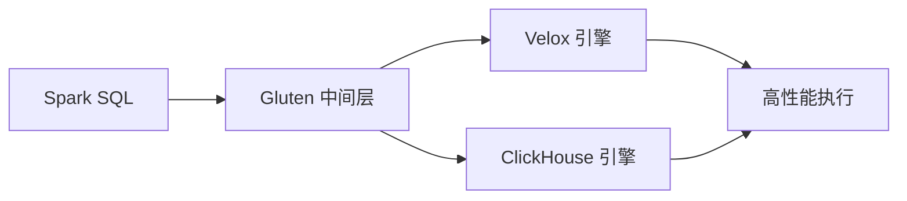

# 第1章：Gluten 简介

> **本章要点**：
> - 理解什么是 Apache Gluten 以及它解决的核心问题
> - 了解 Spark 性能瓶颈和 Gluten 的设计动机
> - 掌握 Gluten 的核心价值和设计目标
> - 认识 Gluten 的发展历史和社区生态
> - 通过性能对比了解 Gluten 的实际效果

## 引言

在大数据处理领域，Apache Spark 已经成为事实上的标准。然而，随着数据规模的不断增长和业务需求的日益复杂，Spark 的性能瓶颈逐渐显现。Apache Gluten 正是为了解决这些问题而诞生的创新项目。

本章将带你全面了解 Gluten 是什么、为什么需要它，以及它能带来哪些价值。

## 1.1 什么是 Apache Gluten

### Gluten 的定义

**Apache Gluten（Incubating）** 是一个用于将基于 JVM 的 SQL 引擎执行卸载到原生引擎的中间层。

"Gluten" 在拉丁语中意为"胶水"。正如其名，Gluten 项目的核心目标是将原生执行引擎"粘合"到 Spark SQL 上，从而结合两者的优势：
- **Spark 的高扩展性**：利用 Spark 成熟的分布式计算框架和生态系统
- **原生引擎的高性能**：利用原生执行引擎的极致性能

### Gluten 的核心理念



Gluten 采用"**控制流在 JVM，计算在原生**"的设计原则：
- **控制流复用**：继续使用 Spark 的任务调度、资源管理、容错机制等
- **计算卸载**：将计算密集型的数据处理操作卸载到原生引擎执行
- **透明集成**：对用户完全透明，无需修改 SQL 代码或 DataFrame API

### Gluten 的技术架构

Gluten 的架构可以简化为三层：

1. **JVM 层（Spark）**：负责查询解析、优化、任务调度
2. **中间层（Gluten）**：负责计划转换、内存管理、数据传输
3. **原生层（Velox/ClickHouse）**：负责高性能的数据处理

```
┌─────────────────────────────────────┐
│   Spark SQL / DataFrame API         │
├─────────────────────────────────────┤
│   Spark Query Optimizer             │
├─────────────────────────────────────┤
│   Gluten Plugin                     │  ← Gluten 中间层
│   - Plan Transformer                │
│   - Memory Manager                  │
│   - JNI Bridge                      │
├─────────────────────────────────────┤
│   Velox / ClickHouse                │  ← 原生执行引擎
│   - Native Operators                │
│   - Vectorized Execution            │
└─────────────────────────────────────┘
```

## 1.2 为什么需要 Gluten（性能瓶颈分析）

### Spark 的性能演进

Apache Spark 经过多年发展，已经非常成熟和稳定：

- **Spark 1.x**：基于 Volcano Model 的行式处理
- **Spark 2.0**：引入 Whole-Stage Code Generation（WSCG），性能提升约 2 倍
- **Spark 3.x**：持续优化，但主要集中在查询计划层面

### 当前的性能瓶颈

尽管 Spark 已经很快，但在以下方面仍有提升空间：

#### 1. JVM 的局限性

- **GC（垃圾回收）开销**：大数据处理产生大量临时对象，GC 压力大
- **对象创建和销毁**：频繁的内存分配影响性能
- **类型装箱/拆箱**：基本类型与对象类型转换的开销

#### 2. 算子性能

即使有了 Code Generation，单个算子的性能仍不如专门优化的原生实现：

```scala
// Spark 的 Filter 实现（简化）
rows.filter { row =>
  row.getInt(0) > 100  // 每次都需要类型转换和安全检查
}

// 原生引擎的 Filter（简化的 C++）
// 直接操作连续内存，充分利用 SIMD 指令
filter_column(int_array, size, threshold);
```

#### 3. 向量化程度

Spark 的 Columnar 支持相对有限，而原生引擎从底层就是为向量化设计的。

### 原生引擎的优势

近年来涌现出多个高性能的原生 SQL 引擎：

- **Velox**（Meta 开源）：C++ 数据库加速库，提供可复用的高性能组件
- **ClickHouse**（Yandex 开源）：专为 OLAP 设计的列式数据库
- **DuckDB**、**DataFusion** 等

这些引擎的共同特点：
- ✅ **原生执行**：C/C++/Rust 实现，无 GC 开销
- ✅ **列式处理**：天然支持向量化
- ✅ **SIMD 优化**：充分利用现代 CPU 指令集
- ✅ **零拷贝**：高效的内存管理

但它们缺少 Spark 的分布式能力和生态系统。

### Gluten 的解决方案

Gluten 巧妙地结合了两者的优势：

| 方面 | Spark | Gluten + 原生引擎 | 提升 |
|------|-------|-------------------|------|
| 分布式能力 | ✅ 成熟 | ✅ 复用 Spark | - |
| 生态系统 | ✅ 丰富 | ✅ 兼容 Spark | - |
| 单机性能 | ⚠️ 受 JVM 限制 | ✅ 原生性能 | 2-3x |
| 内存效率 | ⚠️ GC 压力 | ✅ 手动管理 | 显著提升 |
| 算子性能 | ⚠️ 一般 | ✅ 极致优化 | 2-10x |

## 1.3 Gluten 的设计目标和核心价值

### 设计目标

Gluten 项目的设计目标可以概括为以下几点：

#### 1. 透明性（Transparency）

```scala
// 无需修改代码，只需配置 Gluten
spark.sql("SELECT * FROM table WHERE col > 100")
// 自动使用原生引擎执行
```

用户无需修改任何代码：
- 相同的 SQL 语法
- 相同的 DataFrame API
- 相同的部署方式

#### 2. 高性能（High Performance）

目标是实现 **2-5 倍**的性能提升（取决于查询类型）。

#### 3. 可扩展性（Extensibility）

设计上支持多种后端引擎：
- 当前支持：Velox、ClickHouse
- 未来可以支持：DuckDB、DataFusion 等

#### 4. 兼容性（Compatibility）

- 支持多个 Spark 版本（3.2、3.3、3.4、3.5）
- 提供 Fallback 机制，不支持的算子自动回退到 Spark

#### 5. 易用性（Ease of Use）

- 简单的配置即可启用
- 提供详细的监控指标
- 完善的文档和社区支持

### 核心价值

Gluten 为不同角色的用户带来不同价值：

#### 对于数据分析师

- ✅ **更快的查询响应**：交互式分析体验更好
- ✅ **无需学习新工具**：继续使用熟悉的 Spark SQL

#### 对于数据工程师

- ✅ **降低成本**：相同资源处理更多数据
- ✅ **提高吞吐量**：ETL 任务执行更快
- ✅ **简化运维**：无需维护多套系统

#### 对于平台架构师

- ✅ **性能提升**：显著的查询加速
- ✅ **资源节省**：减少集群规模需求
- ✅ **渐进式迁移**：可以逐步替换，风险可控

#### 对于企业

- ✅ **ROI 提升**：硬件投资获得更好回报
- ✅ **竞争优势**：更快的数据洞察能力
- ✅ **开源生态**：无供应商锁定

## 1.4 Gluten 的发展历史和社区生态

### 项目历史

#### 起源（2022 年初）

Gluten 项目由 **Intel** 和 **Kyligence** 联合发起：
- Intel 在数据库和 Spark 优化方面有深厚积累
- Kyligence 在企业级 OLAP 领域有丰富经验

#### 开源和成长（2022-2023）

- **2022 年 6 月**：Gluten 在 GitHub 开源
- **2022 年 9 月**：Data + AI Summit 上首次公开演示
- **2023 年**：多家大型互联网公司开始贡献代码

#### 进入 Apache 孵化器（2024）

- **2024 年 3 月**：Gluten 成功进入 Apache 孵化器
- 标志着项目的成熟度和社区认可度

```
2022.06        2022.09         2023.06         2024.03         现在
   │              │               │               │             │
   ▼              ▼               ▼               ▼             ▼
开源发布      首次公开演示     生产环境部署    Apache 孵化    持续发展
```

### 社区生态

#### 主要贡献者

多家知名公司活跃参与 Gluten 开发：

- **Intel**：项目发起方，核心架构和 Velox 集成
- **Kyligence**：项目发起方，ClickHouse 集成和企业级功能
- **BIGO**：生产环境验证和性能优化
- **Meituan（美团）**：大规模应用和贡献
- **Alibaba Cloud**：云原生集成
- **NetEase（网易）**：特定场景优化
- **Baidu（百度）**：AI/ML 工作负载优化
- **Microsoft**、**IBM**、**Google** 等也有贡献

#### 社区渠道

- **GitHub**: [https://github.com/apache/incubator-gluten](https://github.com/apache/incubator-gluten)
- **邮件列表**: dev@gluten.apache.org
- **Slack**: ASF Slack 的 #incubator-gluten 频道
- **WeChat**: 中文用户微信群（联系维护者获取邀请）

#### 活跃度

- ⭐ GitHub Stars: 1000+
- 👥 Contributors: 100+
- 🔧 Commits: 3000+
- 📝 Issues/PRs: 持续活跃

## 1.5 Gluten vs 原生 Spark 性能对比

### 基准测试环境

以下测试基于 TPC-H 1TB 数据集：

- **硬件**：单节点，64 核，256GB 内存
- **Spark 版本**：3.3.2
- **测试日期**：2023 年 6 月

### Velox 后端性能

TPC-H 22 个查询的性能对比：

```
查询      Spark    Gluten+Velox    加速比
Q1        45s         12s          3.75x
Q3        38s         15s          2.53x
Q5        52s         18s          2.89x
Q6        15s          3s          5.00x
Q9        78s         25s          3.12x
Q21      125s         42s          2.98x
...
平均       -           -           2.71x
```


<!-- 图表显示各个查询的加速比 -->

**关键发现**：
- 🎯 **平均加速比**：2.71x
- 🚀 **最高加速比**：14.53x（Q6 类简单过滤查询）
- 📊 **稳定性**：所有查询都有提升，无回退

### ClickHouse 后端性能

TPC-H 测试（8 节点集群，1TB 数据）：

```
查询      Spark    Gluten+CH    加速比
Q1        62s        18s        3.44x
Q3        55s        26s        2.12x
Q6        22s         7s        3.14x
...
平均       -          -         2.12x
```

**关键发现**：
- 🎯 **平均加速比**：2.12x
- 🚀 **最高加速比**：3.48x
- 📊 **分布式扩展性**：良好

### 真实场景性能

除了标准基准测试，多家企业在生产环境中验证了 Gluten 的性能：

#### 案例 1：电商日志分析（某互联网公司）

- **场景**：用户行为日志实时分析
- **数据量**：每天 10TB+
- **效果**：
  - 查询延迟降低 60%
  - 集群规模减少 30%
  - 成本节省显著

#### 案例 2：广告推荐系统（某广告平台）

- **场景**：实时特征计算
- **数据量**：每小时数百 GB
- **效果**：
  - 特征计算时间缩短 3 倍
  - 模型迭代速度提升

#### 案例 3：数据仓库 ETL（某金融公司）

- **场景**：夜间批处理任务
- **数据量**：TB 级
- **效果**：
  - ETL 时间从 4 小时缩短到 1.5 小时
  - 处理窗口充裕，风险降低

### 性能提升的来源

Gluten 的性能提升主要来自：

1. **向量化执行**（30-50% 提升）
   - 批量处理数据，减少函数调用开销
   - 充分利用 CPU 缓存

2. **SIMD 指令**（20-40% 提升）
   - 单指令处理多个数据
   - 现代 CPU 的并行能力

3. **内存管理优化**（10-20% 提升）
   - 避免 JVM GC
   - 零拷贝数据传输

4. **算子优化**（20-100% 提升，取决于算子）
   - 专门优化的 Join、Aggregation 等
   - 更好的算法实现

5. **列式存储**（10-30% 提升）
   - 更好的压缩比
   - 更高的 IO 效率

### 何时收益最大

Gluten 在以下场景收益最明显：

✅ **计算密集型查询**
- 复杂的 Join 操作
- 聚合计算
- 窗口函数

✅ **大规模扫描**
- 全表扫描 + 过滤
- 列式数据读取

✅ **列式存储**
- Parquet 格式
- ORC 格式

⚠️ **收益有限的场景**：
- IO 密集型任务（瓶颈在存储）
- 极简单的查询（开销本身就很小）
- 大量 UDF（无法卸载到原生）

## 本章小结

本章我们全面了解了 Apache Gluten：

1. **Gluten 是什么**：一个将 Spark SQL 执行卸载到原生引擎的中间层，实现"控制流在 JVM，计算在原生"

2. **为什么需要 Gluten**：
   - Spark 受限于 JVM 性能
   - 原生引擎有极致性能但缺乏分布式能力
   - Gluten 结合两者优势

3. **Gluten 的价值**：
   - 2-3 倍的性能提升
   - 无需修改代码
   - 降低成本，提高效率

4. **社区生态**：
   - Apache 孵化项目
   - 多家大型企业参与
   - 活跃的开源社区

5. **性能验证**：
   - TPC-H 基准测试：平均 2-3 倍提升
   - 生产环境验证：显著的性能和成本收益

下一章，我们将通过实际操作快速上手 Gluten，让你亲身体验它的强大性能。

## 参考资料

- [Gluten 官方网站](https://gluten.apache.org/)
- [Gluten GitHub 仓库](https://github.com/apache/incubator-gluten)
- [Data + AI Summit 2022 演讲视频](https://www.youtube.com/watch?v=0Q6gHT_N-1U)
- [Gluten 介绍文章（Medium）](https://medium.com/intel-analytics-software/accelerate-spark-sql-queries-with-gluten-9000b65d1b4e)
- [Kyligence 博客（中文）](https://cn.kyligence.io/blog/gluten-spark/)
- [Velox 介绍（Meta）](https://engineering.fb.com/2023/03/09/open-source/velox-open-source-execution-engine/)

---

**下一章预告**：[第2章：快速入门](chapter02-quick-start.md) - 动手安装和使用 Gluten
