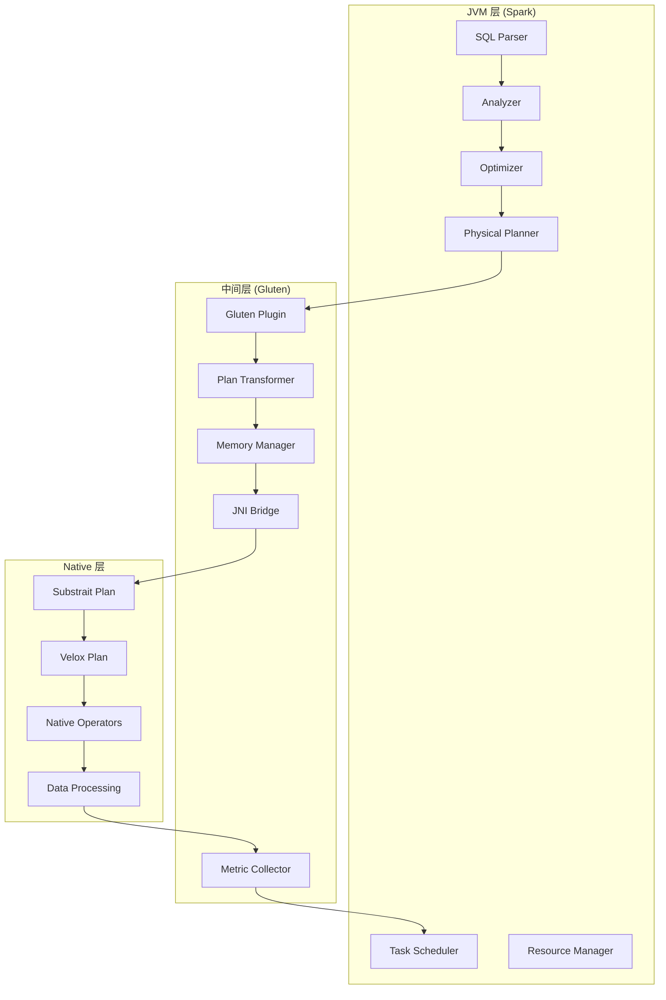
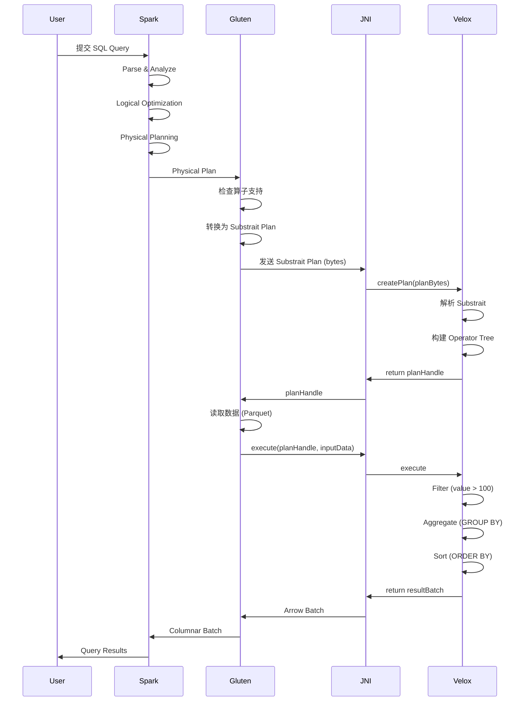

# 第4章：Gluten 整体架构

> **本章要点**：
> - 理解 Gluten 的设计原则和核心思想
> - 掌握 JVM 层和 Native 层的职责划分
> - 了解 Gluten 的核心组件及其交互
> - 理解数据从 Spark 到 Velox 的完整流转过程
> - 掌握 Gluten 与 Spark 的集成机制

## 引言

在前三章中，我们学会了如何使用 Gluten。从本章开始，我们将深入 Gluten 的内部世界，理解它是如何工作的。这对于：
- 高级性能调优
- 问题排查和调试
- 扩展开发和定制化

都至关重要。本章将从整体视角介绍 Gluten 的架构设计。

## 4.1 Gluten 的设计原则

### 4.1.1 核心设计思想

Gluten 的设计遵循"**控制在 JVM，计算在 Native**"的核心原则：

```
┌─────────────────────────────────┐
│        Spark 控制流              │
│  - 任务调度                      │
│  - 资源管理                      │
│  - 容错机制                      │  ← 复用 Spark
│  - 元数据管理                    │
└─────────────────────────────────┘
              ↓
┌─────────────────────────────────┐
│        Gluten 中间层             │
│  - 计划转换                      │
│  - 内存管理                      │  ← Gluten 核心
│  - 数据传输                      │
└─────────────────────────────────┘
              ↓
┌─────────────────────────────────┐
│        Native 执行引擎           │
│  - 数据处理                      │
│  - 向量化计算                    │  ← 高性能执行
│  - SIMD 优化                     │
└─────────────────────────────────┘
```

### 4.1.2 设计原则详解

#### 原则 1：最小侵入性

**目标**：对 Spark 的改动最小化

**实现**：
- 通过 Spark Plugin 机制集成
- 不修改 Spark 核心代码
- 完全兼容 Spark API

**好处**：
- 易于升级 Spark 版本
- 降低维护成本
- 提高稳定性

#### 原则 2：透明性

**目标**：用户无感知

**实现**：
```scala
// 用户代码无需任何修改
val df = spark.sql("SELECT * FROM table WHERE value > 100")
// Gluten 自动介入，使用原生引擎执行
```

**好处**：
- 零学习成本
- 平滑迁移
- 兼容现有代码

#### 原则 3：可扩展性

**目标**：支持多种后端引擎

**实现**：
```
Gluten Core (统一接口)
    ├── Velox Backend
    ├── ClickHouse Backend
    └── Future Backend (可扩展)
```

**好处**：
- 灵活选择后端
- 适应不同场景
- 持续演进能力

#### 原则 4：性能优先

**目标**：最大化计算性能

**实现**：
- 零拷贝数据传输
- 向量化批处理
- SIMD 指令优化
- 内存预分配

#### 原则 5：渐进式 Fallback

**目标**：确保正确性

**实现**：
- 不支持的算子自动回退
- 算子级别的细粒度控制
- 保证结果正确性

### 4.1.3 设计权衡

| 方面 | 选择 | 权衡考虑 |
|------|------|----------|
| 集成方式 | Plugin | 非侵入 vs 深度集成 |
| 数据格式 | Arrow | 标准化 vs 性能 |
| 内存管理 | Off-Heap | 性能 vs 复杂度 |
| Fallback | 自动 | 正确性 vs 性能 |
| 后端选择 | 可插拔 | 灵活性 vs 维护成本 |

## 4.2 架构分层：JVM 层 vs Native 层

Gluten 采用分层架构，清晰地划分 JVM 层和 Native 层的职责。

### 4.2.1 三层架构模型



### 4.2.2 JVM 层职责

**核心功能**：
1. **SQL 解析和优化**
   - SQL 文本解析
   - 语法和语义分析
   - 逻辑计划优化
   - 物理计划生成

2. **任务调度**
   - 任务分配
   - 资源管理
   - 负载均衡
   - 容错处理

3. **元数据管理**
   - Catalog 管理
   - 表元数据
   - 分区信息
   - 统计信息

4. **数据源管理**
   - 文件路径解析
   - 分区裁剪
   - 数据定位

**Spark 组件直接复用**：
```scala
// Spark 的这些组件完全复用
- SparkContext
- SQLContext / SparkSession
- DAGScheduler
- TaskScheduler
- ShuffleManager (Columnar 版本)
- BlockManager
```

### 4.2.3 Gluten 中间层职责

**核心功能**：

1. **计划转换**
   ```
   Spark Physical Plan
          ↓
   Substrait Plan
          ↓
   Native Backend Plan
   ```

2. **内存管理**
   - Off-Heap 内存分配
   - 内存池管理
   - 内存监控和回收

3. **JNI 桥接**
   - Java 到 C++ 调用
   - 数据类型转换
   - 异常处理

4. **指标收集**
   - 执行时间统计
   - 内存使用监控
   - Fallback 信息记录

### 4.2.4 Native 层职责

**核心功能**：

1. **计划解析**
   ```cpp
   // 解析 Substrait Plan
   substrait::Plan plan = parseSubstraitPlan(planBytes);
   
   // 转换为 Velox Plan
   auto veloxPlan = toVeloxPlan(plan);
   ```

2. **数据处理**
   - Filter 过滤
   - Project 投影
   - Aggregate 聚合
   - Join 连接
   - Sort 排序

3. **向量化执行**
   ```cpp
   // 批量处理数据
   for (auto& batch : inputBatches) {
       auto result = operator->process(batch);
       output.push_back(result);
   }
   ```

4. **内存管理**
   - 内存池分配
   - Spill 到磁盘
   - 内存回收

## 4.3 核心组件概览

### 4.3.1 Gluten Plugin

**位置**：JVM 层入口

**功能**：
```scala
class GlutenPlugin extends SparkPlugin {
  // 1. 加载 Native 库
  override def driverPlugin(): DriverPlugin = {
    loadNativeLibraries()
    new GlutenDriverPlugin()
  }
  
  // 2. 注册 Transformer Rules
  override def registerSparkExtensions(extensions: SparkSessionExtensions): Unit = {
    extensions.injectPlannerStrategy(_ => GlutenStrategy)
    extensions.injectPostHocResolutionRule(_ => GlutenFallbackRule)
  }
  
  // 3. 注册监听器
  override def registerSparkListeners(spark: SparkContext): Unit = {
    spark.addSparkListener(new GlutenSparkListener())
  }
}
```

**关键职责**：
- ✅ 初始化 Gluten 环境
- ✅ 加载 Native 动态库
- ✅ 注册查询优化规则
- ✅ 设置内存管理器

### 4.3.2 Plan Transformer

**位置**：Gluten 中间层核心

**功能**：将 Spark Physical Plan 转换为可执行的 Native Plan

**转换流程**：
```scala
object GlutenPlanTransformer {
  def transform(sparkPlan: SparkPlan): Option[TransformContext] = {
    sparkPlan match {
      // Filter 算子
      case FilterExec(condition, child) =>
        Some(FilterExecTransformer(condition, child))
        
      // Project 算子
      case ProjectExec(projectList, child) =>
        Some(ProjectExecTransformer(projectList, child))
        
      // Aggregate 算子
      case HashAggregateExec(...) =>
        Some(HashAggregateExecTransformer(...))
        
      // 不支持的算子
      case _ =>
        None // 触发 Fallback
    }
  }
}
```

**Transformer 层次结构**：
```
TransformerApi (接口)
    ├── FilterExecTransformer
    ├── ProjectExecTransformer
    ├── HashAggregateExecTransformer
    ├── HashJoinExecTransformer
    ├── ShuffleExchangeExecTransformer
    └── ...
```

### 4.3.3 Memory Manager

**位置**：Gluten 中间层

**功能**：统一管理 JVM 和 Native 内存

**架构**：
```scala
class GlutenMemoryManager {
  // Off-Heap 内存池
  private val offHeapPool: MemoryPool
  
  // 任务内存分配
  def allocateTaskMemory(taskId: Long, size: Long): MemoryBlock = {
    if (memoryIsolationEnabled) {
      allocateIsolatedMemory(taskId, size)
    } else {
      allocateSharedMemory(size)
    }
  }
  
  // 内存回收
  def releaseMemory(block: MemoryBlock): Unit = {
    offHeapPool.free(block)
  }
  
  // 内存溢出处理
  def spillIfNeeded(): Unit = {
    if (usedMemory > threshold) {
      triggerSpill()
    }
  }
}
```

**内存层次**：
```
MemoryManager
    ├── Execution Memory Pool (用于算子执行)
    ├── Storage Memory Pool (用于数据缓存)
    └── Spill Memory Pool (溢出到磁盘)
```

### 4.3.4 JNI Bridge

**位置**：JVM 和 Native 的边界

**功能**：实现 Java 和 C++ 之间的互操作

**关键接口**：
```java
// Java 侧
public class NativePlanEvaluator {
    // 创建 Native Plan
    private native long nativeCreatePlan(byte[] substraitPlan);
    
    // 执行计划
    private native long nativeExecute(long planHandle, long[] inputHandles);
    
    // 释放资源
    private native void nativeRelease(long handle);
}
```

```cpp
// C++ 侧
extern "C" {
    // 创建计划
    JNIEXPORT jlong JNICALL Java_...nativeCreatePlan(
        JNIEnv* env, jobject obj, jbyteArray planBytes
    ) {
        auto plan = createPlanFromBytes(planBytes);
        return reinterpret_cast<jlong>(plan);
    }
    
    // 执行计划
    JNIEXPORT jlong JNICALL Java_...nativeExecute(
        JNIEnv* env, jobject obj, jlong planHandle, jlongArray inputs
    ) {
        auto result = executePlan(planHandle, inputs);
        return reinterpret_cast<jlong>(result);
    }
}
```

**数据传递机制**：
```
Java                    C++
  │                      │
  ├─ Arrow Batch ──────► │ Arrow Batch
  │  (零拷贝)            │
  │                      │
  │◄──── Result ──────── │ Result Batch
  │                      │
```

### 4.3.5 Substrait Module

**位置**：协议转换层

**功能**：作为 Spark 和 Native 引擎之间的协议桥梁

**Substrait 简介**：
- 跨语言的数据处理计划表示
- Protocol Buffers 格式
- 引擎中立的标准

**转换示例**：
```protobuf
// Substrait Plan 示例
{
  "relations": [{
    "rel": {
      "filter": {
        "input": {
          "read": {
            "baseSchema": {...},
            "filter": {...}
          }
        },
        "condition": {
          "scalarFunction": {
            "functionReference": 0,
            "arguments": [...]
          }
        }
      }
    }
  }]
}
```

**转换流程**：
```
Spark Catalyst Expression
        ↓
Substrait Expression
        ↓
Velox Expression
        ↓
Native Execution
```

### 4.3.6 Columnar Shuffle Manager

**位置**：Shuffle 层

**功能**：实现列式 Shuffle

**架构**：
```scala
class ColumnarShuffleManager extends ShuffleManager {
  // Shuffle Writer
  override def getWriter(...): ShuffleWriter[K, V] = {
    new ColumnarShuffleWriter(...)
  }
  
  // Shuffle Reader
  override def getReader(...): ShuffleReader[K, C] = {
    new ColumnarShuffleReader(...)
  }
}
```

**数据流**：
```
Map Task
  ↓
Columnar Batch
  ↓
Partition & Serialize
  ↓
Shuffle Write
  ↓
[Disk / Remote Shuffle Service]
  ↓
Shuffle Read
  ↓
Deserialize
  ↓
Columnar Batch
  ↓
Reduce Task
```

## 4.4 数据流转过程

让我们跟踪一个完整的查询执行过程，理解数据如何在各个组件间流转。

### 4.4.1 查询示例

```sql
SELECT category, AVG(value) as avg_val
FROM sales
WHERE value > 100
GROUP BY category
ORDER BY avg_val DESC
```

### 4.4.2 完整流程图



### 4.4.3 详细步骤解析

#### 步骤 1：SQL 解析和优化（Spark）

```scala
// 1. 解析 SQL
val parsedPlan = spark.sessionState.sqlParser.parsePlan(sql)

// 2. 分析和解析
val analyzedPlan = spark.sessionState.analyzer.execute(parsedPlan)

// 3. 逻辑优化
val optimizedPlan = spark.sessionState.optimizer.execute(analyzedPlan)

// 4. 物理计划生成
val physicalPlan = spark.sessionState.planner.plan(optimizedPlan).next()
```

**输出**：
```
HashAggregateExec
  └─ SortExec
      └─ HashAggregateExec (partial)
          └─ FilterExec
              └─ FileScanExec
```

#### 步骤 2：计划转换（Gluten）

```scala
// Gluten Strategy 介入
object GlutenStrategy extends Strategy {
  def apply(plan: LogicalPlan): Seq[SparkPlan] = {
    plan match {
      case _ =>
        // 转换为 Gluten Transformer
        val glutenPlan = transformToGlutenPlan(plan)
        Seq(glutenPlan)
    }
  }
}
```

**转换后的计划**：
```
HashAggregateExecTransformer
  └─ SortExecTransformer
      └─ HashAggregateExecTransformer (partial)
          └─ FilterExecTransformer
              └─ FileScanTransformer
```

#### 步骤 3：Substrait 生成（Gluten）

```scala
// 生成 Substrait Plan
val substraitPlan = SubstraitPlanBuilder()
  .addRelation(
    Filter(
      condition = greaterThan(field("value"), literal(100)),
      input = FileScan(...)
    )
  )
  .addRelation(
    Aggregate(
      groupings = Seq(field("category")),
      aggregates = Seq(avg(field("value")))
    )
  )
  .addRelation(
    Sort(
      keys = Seq(field("avg_val")),
      direction = DESC
    )
  )
  .build()

// 序列化为字节数组
val planBytes = substraitPlan.toByteArray
```

#### 步骤 4：Native 执行（Velox）

```cpp
// C++ 侧接收并解析
auto plan = parseSubstraitPlan(planBytes);

// 创建 Operator Pipeline
auto pipeline = createPipeline(plan);
/*
  SortOperator
    └─ AggregateOperator
        └─ FilterOperator
            └─ TableScanOperator
*/

// 执行
auto results = pipeline->execute();
```

#### 步骤 5：结果返回

```cpp
// Velox 返回 Arrow Batch
std::shared_ptr<arrow::RecordBatch> resultBatch = results;

// 通过 JNI 返回 Java
return reinterpret_cast<jlong>(resultBatch.get());
```

```scala
// Gluten 接收结果
val arrowBatch = receiveFromNative(resultHandle)

// 转换为 Spark Columnar Batch
val columnarBatch = ArrowColumnarBatch(arrowBatch)

// 返回给 Spark
return columnarBatch
```

### 4.4.4 数据格式转换

整个流程中的数据格式变化：

```
Parquet File
    ↓ (FileScanTransformer)
Arrow Batch (Native)
    ↓ (FilterOperator)
Arrow Batch (Filtered)
    ↓ (AggregateOperator)
Arrow Batch (Aggregated)
    ↓ (JNI)
Columnar Batch (Java)
    ↓ (Spark)
DataFrame / Result
```

## 4.5 与 Spark 的集成机制

### 4.5.1 Plugin 机制

Spark 3.x 引入了 Plugin API，Gluten 正是利用这个机制实现无侵入集成。

**Plugin 接口**：
```scala
trait SparkPlugin {
  // Driver 端插件
  def driverPlugin(): DriverPlugin
  
  // Executor 端插件
  def executorPlugin(): ExecutorPlugin
}
```

**Gluten 实现**：
```scala
class GlutenPlugin extends SparkPlugin {
  override def driverPlugin(): DriverPlugin = {
    new GlutenDriverPlugin()
  }
  
  override def executorPlugin(): ExecutorPlugin = {
    new GlutenExecutorPlugin()
  }
}
```

**加载方式**：
```properties
spark.plugins=org.apache.gluten.GlutenPlugin
```

### 4.5.2 Extension Points

Gluten 利用 Spark 的多个扩展点：

#### 1. Planner Strategy
```scala
extensions.injectPlannerStrategy(_ => GlutenStrategy)
```

**作用**：在物理计划阶段介入，将 Spark 算子替换为 Gluten Transformer

#### 2. Post-Hoc Resolution Rule
```scala
extensions.injectPostHocResolutionRule(_ => GlutenFallbackRule)
```

**作用**：在计划生成后，处理 Fallback 逻辑

#### 3. Columnar Rule
```scala
extensions.injectColumnar(_ => GlutenColumnarRule)
```

**作用**：处理列式数据转换

### 4.5.3 Catalyst Integration

Gluten 深度集成 Spark Catalyst 优化器：

**优化规则链**：
```
Spark Logical Plan
    ↓ (Spark Optimizer)
Optimized Logical Plan
    ↓ (Spark Planner)
Physical Plan
    ↓ (Gluten Strategy)
Gluten Transformed Plan
    ↓ (Fallback Rule)
Final Executable Plan
```

### 4.5.4 Columnar API 集成

Spark 3.0+ 引入 Columnar API，Gluten 完全兼容：

```scala
// Gluten 的 Columnar Batch 实现
class ArrowColumnarBatch(
  val arrowBatch: RecordBatch
) extends ColumnarBatch {
  
  override def numRows(): Int = arrowBatch.getLength
  
  override def numCols(): Int = arrowBatch.getFieldVectors.size()
  
  override def column(ordinal: Int): ColumnVector = {
    new ArrowColumnVector(arrowBatch.getVector(ordinal))
  }
}
```

## 本章小结

本章我们学习了 Gluten 的整体架构：

1. ✅ **设计原则**：理解了"控制在 JVM，计算在 Native"的核心思想
2. ✅ **架构分层**：掌握了 JVM 层、Gluten 层和 Native 层的职责划分
3. ✅ **核心组件**：了解了 Plugin、Transformer、Memory Manager、JNI Bridge 等核心组件
4. ✅ **数据流转**：跟踪了一个完整查询从 SQL 到结果的执行过程
5. ✅ **集成机制**：理解了 Gluten 如何通过 Plugin 和 Extension API 与 Spark 集成

下一章我们将深入查询计划转换，详细介绍 Spark Plan 如何转换为 Substrait Plan，再到 Native Plan。

## 参考资料

- [Spark Plugin API](https://spark.apache.org/docs/latest/api/scala/org/apache/spark/api/plugin/index.html)
- [Spark Catalyst Optimizer](https://databricks.com/glossary/catalyst-optimizer)
- [Substrait Specification](https://substrait.io/)
- [Apache Arrow](https://arrow.apache.org/)

---

**下一章预告**：[第5章：查询计划转换](chapter05-query-plan-transformation.md) - 深入理解 Spark → Substrait → Native 的转换过程
