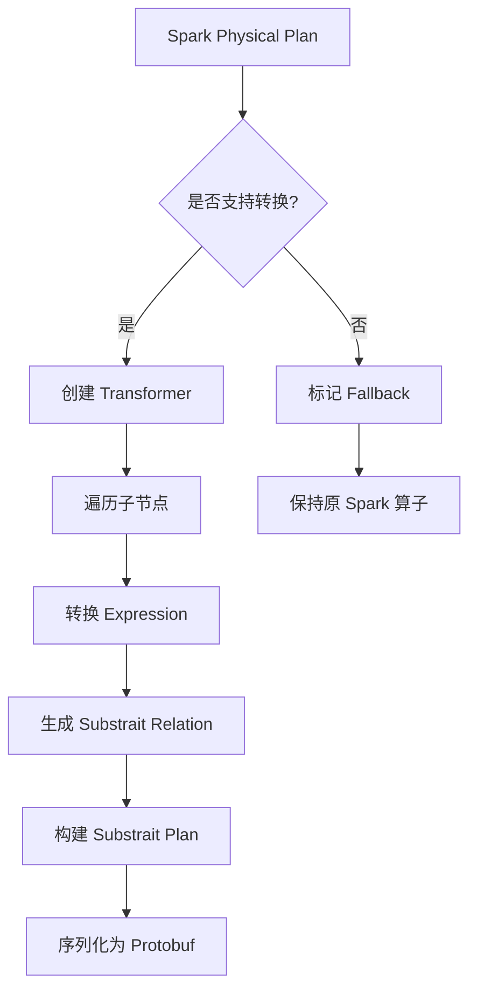

# 第5章：查询计划转换

> **本章要点**：
> - 理解 Spark Physical Plan 的结构和特点
> - 掌握 Substrait 协议规范和设计理念
> - 深入学习 Spark Plan 到 Substrait Plan 的转换过程
> - 了解 Substrait Plan 到 Native Plan 的映射
> - 掌握计划转换的优化策略
> - 理解不支持算子的识别和处理

## 引言

查询计划转换是 Gluten 最核心的功能之一。它就像一个"翻译器"，将 Spark 的执行计划翻译成原生引擎能够理解和执行的格式。本章将深入剖析这个转换过程的每个细节。

## 5.1 Spark Physical Plan 介绍

### 5.1.1 Catalyst 优化器回顾

Spark 的 Catalyst 优化器采用树形结构表示查询计划：

```
逻辑计划树
    ↓ (Analyzer)
已解析的逻辑计划
    ↓ (Optimizer)
优化后的逻辑计划
    ↓ (Planner)
物理计划树
```

### 5.1.2 Physical Plan 结构

Physical Plan 是一棵由 SparkPlan 节点组成的树：

```scala
abstract class SparkPlan extends QueryPlan[SparkPlan] {
  // 执行方法
  def execute(): RDD[InternalRow]
  
  // 列式执行（如果支持）
  def executeColumnar(): RDD[ColumnarBatch]
  
  // 子节点
  def children: Seq[SparkPlan]
}
```

**常见算子示例**：

```scala
// Filter 算子
case class FilterExec(
  condition: Expression,
  child: SparkPlan
) extends UnaryExecNode

// Project 算子
case class ProjectExec(
  projectList: Seq[NamedExpression],
  child: SparkPlan
) extends UnaryExecNode

// HashAggregate 算子
case class HashAggregateExec(
  requiredChildDistributionExpressions: Option[Seq[Expression]],
  groupingExpressions: Seq[NamedExpression],
  aggregateExpressions: Seq[AggregateExpression],
  aggregateAttributes: Seq[Attribute],
  initialInputBufferOffset: Int,
  resultExpressions: Seq[NamedExpression],
  child: SparkPlan
) extends UnaryExecNode

// Join 算子
case class ShuffledHashJoinExec(
  leftKeys: Seq[Expression],
  rightKeys: Seq[Expression],
  joinType: JoinType,
  buildSide: BuildSide,
  condition: Option[Expression],
  left: SparkPlan,
  right: SparkPlan
) extends BinaryExecNode
```

### 5.1.3 Physical Plan 示例

对于查询：
```sql
SELECT category, AVG(value) as avg_val
FROM sales
WHERE value > 100
GROUP BY category
```

生成的 Physical Plan：
```
HashAggregateExec (Final)
  hashKeys: [category#0]
  functions: [avg(value#1)]
  ↓
Exchange (Shuffle)
  hashpartitioning(category#0, 200)
  ↓
HashAggregateExec (Partial)
  hashKeys: [category#0]
  functions: [partial_avg(value#1)]
  ↓
ProjectExec
  [category#0, value#1]
  ↓
FilterExec
  (value#1 > 100)
  ↓
FileScanExec
  [category#0, value#1]
  PushedFilters: [IsNotNull(value)]
```

### 5.1.4 Expression 树

Physical Plan 的每个节点都包含 Expression 树：

```scala
// Expression 层次结构
sealed abstract class Expression

// 叶子节点 - 字段引用
case class AttributeReference(
  name: String,
  dataType: DataType,
  ...
) extends LeafExpression

// 叶子节点 - 字面量
case class Literal(
  value: Any,
  dataType: DataType
) extends LeafExpression

// 一元表达式
case class UnaryMinus(child: Expression) extends UnaryExpression

// 二元表达式
case class Add(left: Expression, right: Expression) extends BinaryExpression

// 函数调用
case class ScalarFunction(
  name: String,
  arguments: Seq[Expression]
) extends Expression
```

**示例**：`value > 100` 的 Expression 树：
```
GreaterThan
  ├─ AttributeReference("value", IntegerType)
  └─ Literal(100, IntegerType)
```

## 5.2 Substrait 规范详解

### 5.2.1 Substrait 简介

**Substrait** 是一个跨语言、跨引擎的查询计划表示标准。

**设计目标**：
- 📋 **标准化**：统一的计划表示
- 🔌 **可扩展**：支持自定义扩展
- 🚀 **高效**：Protocol Buffers 序列化
- 🌐 **跨平台**：语言无关

### 5.2.2 Substrait 核心概念

#### 1. Plan (计划)

```protobuf
message Plan {
  // 版本信息
  Version version = 1;
  
  // 扩展信息
  repeated Extension extensions = 2;
  
  // 关系（查询操作）
  repeated PlanRel relations = 3;
  
  // 高级扩展
  google.protobuf.Any advanced_extensions = 4;
}
```

#### 2. Relation (关系)

Relation 是查询计划的基本单元：

```protobuf
message Rel {
  oneof rel_type {
    ReadRel read = 1;           // 读取操作
    FilterRel filter = 2;       // 过滤操作
    ProjectRel project = 3;     // 投影操作
    AggregateRel aggregate = 4; // 聚合操作
    JoinRel join = 5;           // 连接操作
    SortRel sort = 6;           // 排序操作
    // ... 更多关系类型
  }
}
```

#### 3. Expression (表达式)

```protobuf
message Expression {
  oneof expression_type {
    Literal literal = 1;              // 字面量
    Selection selection = 2;          // 字段选择
    ScalarFunction scalar_function = 3; // 标量函数
    Cast cast = 4;                    // 类型转换
    // ... 更多表达式类型
  }
}
```

### 5.2.3 常用 Relation 详解

#### ReadRel (读取)

```protobuf
message ReadRel {
  // 基础 Schema
  NamedStruct base_schema = 1;
  
  // 数据源
  oneof read_type {
    VirtualTable virtual_table = 2;
    LocalFiles local_files = 3;
    NamedTable named_table = 4;
  }
  
  // 过滤条件（谓词下推）
  Expression filter = 5;
  
  // 投影（列裁剪）
  MaskExpression projection = 6;
}
```

**对应 Spark**：`FileScanExec`

#### FilterRel (过滤)

```protobuf
message FilterRel {
  // 输入关系
  Rel input = 1;
  
  // 过滤条件
  Expression condition = 2;
}
```

**对应 Spark**：`FilterExec`

#### ProjectRel (投影)

```protobuf
message ProjectRel {
  // 输入关系
  Rel input = 1;
  
  // 投影表达式列表
  repeated Expression expressions = 2;
}
```

**对应 Spark**：`ProjectExec`

#### AggregateRel (聚合)

```protobuf
message AggregateRel {
  // 输入关系
  Rel input = 1;
  
  // 分组键
  repeated Expression groupings = 2;
  
  // 聚合函数
  repeated AggregateFunction measures = 3;
}

message AggregateFunction {
  // 函数引用
  uint32 function_reference = 1;
  
  // 参数
  repeated Expression arguments = 2;
  
  // 聚合阶段（INITIAL, INTERMEDIATE, FINAL）
  AggregationPhase phase = 3;
}
```

**对应 Spark**：`HashAggregateExec`

#### JoinRel (连接)

```protobuf
message JoinRel {
  // 左侧输入
  Rel left = 1;
  
  // 右侧输入
  Rel right = 2;
  
  // 连接条件
  Expression expression = 3;
  
  // 连接类型
  JoinType type = 4;
  
  // 后过滤条件
  Expression post_join_filter = 5;
}

enum JoinType {
  JOIN_TYPE_UNSPECIFIED = 0;
  JOIN_TYPE_INNER = 1;
  JOIN_TYPE_OUTER = 2;
  JOIN_TYPE_LEFT = 3;
  JOIN_TYPE_RIGHT = 4;
  // ...
}
```

**对应 Spark**：`HashJoinExec`, `SortMergeJoinExec`

### 5.2.4 函数扩展机制

Substrait 通过扩展机制支持自定义函数：

```protobuf
message Extension {
  // 扩展 URI
  string extension_uri_reference = 1;
  
  // 扩展函数
  repeated SimpleExtensionDeclaration extension_function = 2;
}

message SimpleExtensionDeclaration {
  // 函数映射
  message ExtensionFunction {
    uint32 function_anchor = 1;  // 函数 ID
    string name = 2;               // 函数名
  }
}
```

**示例**：注册 `regexp_extract` 函数
```json
{
  "extension_uri_reference": "/functions_string.yaml",
  "extension_function": {
    "function_anchor": 42,
    "name": "regexp_extract"
  }
}
```

## 5.3 从 Spark Plan 到 Substrait Plan 的转换

### 5.3.1 转换总体流程



### 5.3.2 Transformer 基类

所有算子的 Transformer 都继承自基类：

```scala
abstract class TransformSupport extends SparkPlan {
  // 是否支持转换
  def supportTransform(): Boolean
  
  // 转换为 Substrait
  def toSubstraitRel(context: SubstraitContext): SubstraitRel
  
  // 获取输出属性
  override def output: Seq[Attribute]
  
  // 列式执行
  override def executeColumnar(): RDD[ColumnarBatch]
}
```

### 5.3.3 具体算子转换

#### FilterExec 转换

```scala
case class FilterExecTransformer(
  condition: Expression,
  child: SparkPlan
) extends UnaryExecNode with TransformSupport {
  
  override def toSubstraitRel(context: SubstraitContext): SubstraitRel = {
    // 1. 转换子节点
    val input = child.asInstanceOf[TransformSupport]
      .toSubstraitRel(context)
    
    // 2. 转换过滤条件
    val conditionExpr = ExpressionConverter
      .toSubstraitExpression(condition, child.output, context)
    
    // 3. 构建 FilterRel
    val filterRel = FilterRel.newBuilder()
      .setInput(input)
      .setCondition(conditionExpr)
      .build()
    
    // 4. 包装为 Rel
    Rel.newBuilder()
      .setFilter(filterRel)
      .build()
  }
}
```

#### ProjectExec 转换

```scala
case class ProjectExecTransformer(
  projectList: Seq[NamedExpression],
  child: SparkPlan
) extends UnaryExecNode with TransformSupport {
  
  override def toSubstraitRel(context: SubstraitContext): SubstraitRel = {
    // 1. 转换子节点
    val input = child.asInstanceOf[TransformSupport]
      .toSubstraitRel(context)
    
    // 2. 转换投影表达式列表
    val expressions = projectList.map { expr =>
      ExpressionConverter.toSubstraitExpression(
        expr, child.output, context
      )
    }
    
    // 3. 构建 ProjectRel
    val projectRel = ProjectRel.newBuilder()
      .setInput(input)
      .addAllExpressions(expressions.asJava)
      .build()
    
    Rel.newBuilder()
      .setProject(projectRel)
      .build()
  }
}
```

#### HashAggregateExec 转换

```scala
case class HashAggregateExecTransformer(
  groupingExpressions: Seq[NamedExpression],
  aggregateExpressions: Seq[AggregateExpression],
  child: SparkPlan
) extends UnaryExecNode with TransformSupport {
  
  override def toSubstraitRel(context: SubstraitContext): SubstraitRel = {
    // 1. 转换子节点
    val input = child.asInstanceOf[TransformSupport]
      .toSubstraitRel(context)
    
    // 2. 转换分组键
    val groupings = groupingExpressions.map { expr =>
      ExpressionConverter.toSubstraitExpression(
        expr, child.output, context
      )
    }
    
    // 3. 转换聚合函数
    val measures = aggregateExpressions.map { aggExpr =>
      val aggFunc = aggExpr.aggregateFunction
      
      // 注册函数
      val funcId = context.registerFunction(
        aggFunc.prettyName
      )
      
      // 构建 AggregateFunction
      AggregateFunction.newBuilder()
        .setFunctionReference(funcId)
        .addAllArguments(
          aggFunc.children.map(e => 
            ExpressionConverter.toSubstraitExpression(e, child.output, context)
          ).asJava
        )
        .setPhase(getAggregatePhase(aggExpr))
        .build()
    }
    
    // 4. 构建 AggregateRel
    val aggregateRel = AggregateRel.newBuilder()
      .setInput(input)
      .addAllGroupings(groupings.asJava)
      .addAllMeasures(measures.asJava)
      .build()
    
    Rel.newBuilder()
      .setAggregate(aggregateRel)
      .build()
  }
  
  private def getAggregatePhase(expr: AggregateExpression): AggregationPhase = {
    expr.mode match {
      case Partial => AggregationPhase.INITIAL
      case PartialMerge => AggregationPhase.INTERMEDIATE
      case Final => AggregationPhase.FINAL
    }
  }
}
```

### 5.3.4 Expression 转换

Expression 的转换是递归过程：

```scala
object ExpressionConverter {
  def toSubstraitExpression(
    expr: Expression,
    inputSchema: Seq[Attribute],
    context: SubstraitContext
  ): SubstraitExpression = {
    
    expr match {
      // 1. 字面量
      case Literal(value, dataType) =>
        SubstraitExpression.newBuilder()
          .setLiteral(toLiteralValue(value, dataType))
          .build()
      
      // 2. 字段引用
      case attr: AttributeReference =>
        val fieldIndex = inputSchema.indexWhere(_.exprId == attr.exprId)
        SubstraitExpression.newBuilder()
          .setSelection(
            FieldReference.newBuilder()
              .setDirectReference(
                Reference.newBuilder()
                  .setStructField(
                    StructField.newBuilder()
                      .setField(fieldIndex)
                  )
              )
          )
          .build()
      
      // 3. 二元表达式
      case Add(left, right) =>
        val funcId = context.registerFunction("add")
        SubstraitExpression.newBuilder()
          .setScalarFunction(
            ScalarFunction.newBuilder()
              .setFunctionReference(funcId)
              .addArguments(toSubstraitExpression(left, inputSchema, context))
              .addArguments(toSubstraitExpression(right, inputSchema, context))
          )
          .build()
      
      // 4. 比较表达式
      case GreaterThan(left, right) =>
        val funcId = context.registerFunction("gt")
        SubstraitExpression.newBuilder()
          .setScalarFunction(
            ScalarFunction.newBuilder()
              .setFunctionReference(funcId)
              .addArguments(toSubstraitExpression(left, inputSchema, context))
              .addArguments(toSubstraitExpression(right, inputSchema, context))
          )
          .build()
      
      // 5. 函数调用
      case ScalarFunction(name, args, _) =>
        val funcId = context.registerFunction(name)
        val substraitArgs = args.map(
          toSubstraitExpression(_, inputSchema, context)
        )
        SubstraitExpression.newBuilder()
          .setScalarFunction(
            ScalarFunction.newBuilder()
              .setFunctionReference(funcId)
              .addAllArguments(substraitArgs.asJava)
          )
          .build()
      
      // 6. CAST 表达式
      case Cast(child, dataType, _) =>
        SubstraitExpression.newBuilder()
          .setCast(
            Cast.newBuilder()
              .setInput(toSubstraitExpression(child, inputSchema, context))
              .setType(toSubstraitType(dataType))
          )
          .build()
      
      // 其他表达式...
      case _ =>
        throw new UnsupportedOperationException(
          s"Unsupported expression: ${expr.getClass.getName}"
        )
    }
  }
  
  // 数据类型转换
  private def toSubstraitType(sparkType: DataType): Type = {
    sparkType match {
      case IntegerType => Type.newBuilder().setI32(Type.I32.newBuilder()).build()
      case LongType => Type.newBuilder().setI64(Type.I64.newBuilder()).build()
      case DoubleType => Type.newBuilder().setFp64(Type.FP64.newBuilder()).build()
      case StringType => Type.newBuilder().setString(Type.String.newBuilder()).build()
      // ... 更多类型
    }
  }
}
```

### 5.3.5 完整转换示例

对于前面的 SQL 查询，完整的转换过程：

```scala
// 1. Spark Physical Plan
val sparkPlan: SparkPlan = 
  HashAggregateExec(
    groupingExpressions = Seq(col("category")),
    aggregateExpressions = Seq(avg(col("value"))),
    child = FilterExec(
      condition = col("value") > 100,
      child = FileScanExec(...)
    )
  )

// 2. 转换为 Gluten Transformer
val glutenPlan = 
  HashAggregateExecTransformer(
    groupingExpressions = Seq(col("category")),
    aggregateExpressions = Seq(avg(col("value"))),
    child = FilterExecTransformer(
      condition = col("value") > 100,
      child = FileScanTransformer(...)
    )
  )

// 3. 生成 Substrait Plan
val context = new SubstraitContext()
val substraitRel = glutenPlan.toSubstraitRel(context)

// 4. 构建完整的 Plan
val substraitPlan = Plan.newBuilder()
  .setVersion(Version.newBuilder().setMinorNumber(42))
  .addExtensions(context.getExtensions())
  .addRelations(
    PlanRel.newBuilder()
      .setRoot(
        RelRoot.newBuilder()
          .setInput(substraitRel)
      )
  )
  .build()

// 5. 序列化
val planBytes = substraitPlan.toByteArray
```

生成的 Substrait Plan (简化的 JSON 表示)：
```json
{
  "version": {"minor_number": 42},
  "extensions": [
    {"extension_function": {"function_anchor": 1, "name": "avg"}},
    {"extension_function": {"function_anchor": 2, "name": "gt"}}
  ],
  "relations": [{
    "root": {
      "input": {
        "aggregate": {
          "input": {
            "filter": {
              "input": {
                "read": {
                  "baseSchema": {...},
                  "localFiles": {...}
                }
              },
              "condition": {
                "scalarFunction": {
                  "functionReference": 2,
                  "arguments": [
                    {"selection": {"directReference": {"structField": {"field": 1}}}},
                    {"literal": {"i32": 100}}
                  ]
                }
              }
            }
          },
          "groupings": [
            {"selection": {"directReference": {"structField": {"field": 0}}}}
          ],
          "measures": [{
            "measure": {
              "functionReference": 1,
              "arguments": [
                {"selection": {"directReference": {"structField": {"field": 1}}}}
              ],
              "phase": "AGGREGATION_PHASE_INITIAL_TO_RESULT"
            }
          }]
        }
      }
    }
  }]
}
```

## 5.4 从 Substrait Plan 到 Native Plan 的转换

### 5.4.1 Velox 端的处理

在 C++ 侧（Velox），接收并解析 Substrait Plan：

```cpp
#include <substrait/plan.pb.h>
#include <velox/exec/PlanNode.h>

namespace gluten {

class SubstraitToVeloxPlanConverter {
public:
  // 转换入口
  std::shared_ptr<velox::core::PlanNode> 
  toVeloxPlan(const substrait::Plan& plan) {
    // 1. 提取 Root Relation
    auto rootRel = plan.relations(0).root();
    
    // 2. 转换 Relation
    return convertRel(rootRel.input());
  }

private:
  // 递归转换 Relation
  std::shared_ptr<velox::core::PlanNode> 
  convertRel(const substrait::Rel& rel) {
    
    if (rel.has_read()) {
      return convertRead(rel.read());
    } else if (rel.has_filter()) {
      return convertFilter(rel.filter());
    } else if (rel.has_project()) {
      return convertProject(rel.project());
    } else if (rel.has_aggregate()) {
      return convertAggregate(rel.aggregate());
    } else if (rel.has_join()) {
      return convertJoin(rel.join());
    }
    // ... 其他类型
    
    throw std::runtime_error("Unsupported relation type");
  }
  
  // 转换 Filter
  std::shared_ptr<velox::core::FilterNode> 
  convertFilter(const substrait::FilterRel& filterRel) {
    // 1. 转换输入
    auto input = convertRel(filterRel.input());
    
    // 2. 转换过滤条件
    auto condition = convertExpression(
      filterRel.condition(), 
      input->outputType()
    );
    
    // 3. 创建 FilterNode
    return std::make_shared<velox::core::FilterNode>(
      nextPlanNodeId(),
      condition,
      input
    );
  }
  
  // 转换 Aggregate
  std::shared_ptr<velox::core::AggregationNode> 
  convertAggregate(const substrait::AggregateRel& aggRel) {
    // 1. 转换输入
    auto input = convertRel(aggRel.input());
    
    // 2. 转换分组键
    std::vector<velox::core::FieldAccessTypedExprPtr> groupingKeys;
    for (const auto& grouping : aggRel.groupings()) {
      groupingKeys.push_back(
        convertFieldReference(grouping, input->outputType())
      );
    }
    
    // 3. 转换聚合函数
    std::vector<velox::core::AggregationNode::Aggregate> aggregates;
    for (const auto& measure : aggRel.measures()) {
      auto aggFunc = measure.measure();
      
      // 获取函数名
      std::string funcName = getFunctionName(
        aggFunc.function_reference()
      );
      
      // 转换参数
      std::vector<velox::core::TypedExprPtr> args;
      for (const auto& arg : aggFunc.arguments()) {
        args.push_back(convertExpression(arg, input->outputType()));
      }
      
      // 创建聚合
      aggregates.push_back({
        .call = std::make_shared<velox::core::CallTypedExpr>(
          funcName,
          args,
          getResultType(funcName, args)
        ),
        .rawInputTypes = getInputTypes(args)
      });
    }
    
    // 4. 创建 AggregationNode
    return std::make_shared<velox::core::AggregationNode>(
      nextPlanNodeId(),
      velox::core::AggregationNode::Step::kSingle,
      groupingKeys,
      std::vector<velox::core::FieldAccessTypedExprPtr>(), // preGroupedKeys
      std::vector<std::string>(), // aggregateNames
      aggregates,
      false, // ignoreNullKeys
      input
    );
  }
  
  // 转换 Expression
  velox::core::TypedExprPtr 
  convertExpression(
    const substrait::Expression& expr,
    const velox::RowTypePtr& inputType
  ) {
    if (expr.has_literal()) {
      return convertLiteral(expr.literal());
    } else if (expr.has_selection()) {
      return convertFieldReference(expr.selection(), inputType);
    } else if (expr.has_scalar_function()) {
      return convertScalarFunction(expr.scalar_function(), inputType);
    } else if (expr.has_cast()) {
      return convertCast(expr.cast(), inputType);
    }
    
    throw std::runtime_error("Unsupported expression type");
  }
  
  // 转换标量函数
  velox::core::TypedExprPtr 
  convertScalarFunction(
    const substrait::Expression::ScalarFunction& func,
    const velox::RowTypePtr& inputType
  ) {
    // 1. 获取函数名
    std::string funcName = getFunctionName(func.function_reference());
    
    // 2. 转换参数
    std::vector<velox::core::TypedExprPtr> args;
    for (const auto& arg : func.arguments()) {
      args.push_back(convertExpression(arg, inputType));
    }
    
    // 3. 创建 CallTypedExpr
    return std::make_shared<velox::core::CallTypedExpr>(
      funcName,
      args,
      getResultType(funcName, args)
    );
  }
  
  // 辅助方法：生成 Plan Node ID
  std::string nextPlanNodeId() {
    return std::to_string(planNodeId_++);
  }
  
  // 函数映射
  std::string getFunctionName(uint32_t functionReference) {
    // 从扩展中查找函数名
    return extensionFunctions_[functionReference];
  }
  
  int planNodeId_ = 0;
  std::map<uint32_t, std::string> extensionFunctions_;
};

} // namespace gluten
```

### 5.4.2 Velox Plan Node 结构

转换后的 Velox Plan：

```cpp
// Velox Plan 节点层次
auto plan = 
  std::make_shared<AggregationNode>(
    "1",
    AggregationNode::Step::kSingle,
    groupingKeys: {field("category")},
    aggregates: {
      Aggregate{
        call: CallTypedExpr("avg", {field("value")})
      }
    },
    source: std::make_shared<FilterNode>(
      "2",
      condition: CallTypedExpr("gt", {field("value"), literal(100)}),
      source: std::make_shared<TableScanNode>(
        "3",
        outputType: ROW({"category", "value"}),
        tableHandle: ...
      )
    )
  );
```

### 5.4.3 执行 Pipeline 构建

Velox 将 Plan 转换为执行 Pipeline：

```cpp
class Task {
public:
  void start() {
    // 1. 构建 Driver Pipeline
    auto drivers = createDrivers(planNode_);
    
    // 2. 执行 Drivers
    for (auto& driver : drivers) {
      driver->run();
    }
  }

private:
  std::vector<std::unique_ptr<Driver>> 
  createDrivers(const PlanNodePtr& node) {
    // 创建 Operator Pipeline
    std::vector<std::unique_ptr<Operator>> operators;
    
    // 深度优先遍历
    addOperators(node, operators);
    
    // 创建 Driver
    std::vector<std::unique_ptr<Driver>> drivers;
    drivers.push_back(
      std::make_unique<Driver>(std::move(operators))
    );
    
    return drivers;
  }
  
  void addOperators(
    const PlanNodePtr& node,
    std::vector<std::unique_ptr<Operator>>& operators
  ) {
    // 递归添加
    for (auto& child : node->sources()) {
      addOperators(child, operators);
    }
    
    // 创建对应的 Operator
    if (auto filterNode = std::dynamic_pointer_cast<FilterNode>(node)) {
      operators.push_back(
        std::make_unique<FilterOperator>(filterNode)
      );
    } else if (auto aggNode = std::dynamic_pointer_cast<AggregationNode>(node)) {
      operators.push_back(
        std::make_unique<AggregationOperator>(aggNode)
      );
    }
    // ... 其他类型
  }
};
```

**Pipeline 示例**：
```
TableScanOperator
    ↓
FilterOperator
    ↓
AggregationOperator (Partial)
    ↓
LocalExchangeOperator
    ↓
AggregationOperator (Final)
```

## 5.5 计划转换的优化策略

### 5.5.1 谓词下推

将过滤条件尽可能下推到数据源：

```scala
// 优化前
Project
  ↓
Filter (value > 100)
  ↓
FileScan

// 优化后
Project
  ↓
FileScan (with pushed filter: value > 100)
```

**实现**：
```scala
object PushDownFilters extends Rule[SparkPlan] {
  def apply(plan: SparkPlan): SparkPlan = plan transform {
    case FilterExec(condition, scan: FileScanExec) 
      if canPushDown(condition, scan) =>
      
      // 将过滤条件添加到 FileScan
      scan.copy(
        dataFilters = scan.dataFilters :+ condition
      )
  }
}
```

### 5.5.2 列裁剪

只读取需要的列：

```scala
// 原始查询选择所有列
SELECT category, value FROM table

// 优化：只读取需要的列
FileScan: [category#0, value#1]  // 不读取其他列
```

### 5.5.3 Projection 折叠

合并连续的 Projection：

```scala
// 优化前
Project [category, avg_value * 2]
  ↓
Project [category, avg(value) as avg_value]
  ↓
...

// 优化后
Project [category, avg(value) * 2]
  ↓
...
```

**实现**：
```scala
object CollapseProject extends Rule[SparkPlan] {
  def apply(plan: SparkPlan): SparkPlan = plan transform {
    case ProjectExec(list1, ProjectExec(list2, child)) =>
      // 合并两个 Project
      val newList = list1.map { expr =>
        expr.transform {
          case attr: Attribute =>
            list2.find(_.exprId == attr.exprId)
              .map(_.child)
              .getOrElse(attr)
        }
      }
      ProjectExec(newList, child)
  }
}
```

### 5.5.4 聚合优化

**Partial Aggregation**：

```scala
// 两阶段聚合
HashAggregate (Final)
  ↓
Exchange (Shuffle)
  ↓
HashAggregate (Partial)  // 预聚合，减少 Shuffle 数据量
  ↓
Scan
```

### 5.5.5 Join 优化

**Broadcast Join 检测**：

```scala
if (rightTableSize < broadcastThreshold) {
  // 使用 Broadcast Join
  BroadcastHashJoinExec(...)
} else {
  // 使用 Shuffled Join
  ShuffledHashJoinExec(...)
}
```

## 5.6 不支持算子的处理（Fallback）

### 5.6.1 支持性检查

在转换前，先检查算子是否支持：

```scala
object SupportChecker {
  def isSupported(plan: SparkPlan): Boolean = plan match {
    // 支持的算子
    case _: FilterExec => true
    case _: ProjectExec => true
    case _: HashAggregateExec => true
    case _: ShuffledHashJoinExec => true
    
    // 不支持的算子
    case _: SortMergeJoinExec => false
    case _: WindowExec => checkWindowSupport(plan)
    
    // 递归检查子节点
    case other =>
      other.children.forall(isSupported)
  }
  
  def checkWindowSupport(plan: SparkPlan): Boolean = {
    // 检查 Window 函数是否都支持
    plan match {
      case window: WindowExec =>
        window.windowExpression.forall { expr =>
          isSupportedWindowFunction(expr)
        }
      case _ => true
    }
  }
}
```

### 5.6.2 Fallback 标记

不支持的算子保持原样：

```scala
// 转换规则
object GlutenTransformStrategy extends Strategy {
  def apply(plan: LogicalPlan): Seq[SparkPlan] = {
    val physicalPlan = defaultStrategy(plan)
    
    // 尝试转换
    val transformedPlan = tryTransform(physicalPlan)
    
    Seq(transformedPlan)
  }
  
  private def tryTransform(plan: SparkPlan): SparkPlan = {
    if (SupportChecker.isSupported(plan)) {
      // 转换为 Gluten 算子
      plan match {
        case filter: FilterExec =>
          FilterExecTransformer(filter.condition, tryTransform(filter.child))
        case project: ProjectExec =>
          ProjectExecTransformer(project.projectList, tryTransform(project.child))
        // ... 其他算子
      }
    } else {
      // 保持原 Spark 算子，但需要添加转换层
      insertColumnarToRow(plan)
    }
  }
}
```

### 5.6.3 数据格式转换

Fallback 时需要在列式和行式之间转换：

```scala
// 插入 ColumnarToRow
def insertColumnarToRow(plan: SparkPlan): SparkPlan = {
  if (plan.supportsColumnar) {
    ColumnarToRowExec(plan)
  } else {
    plan.withNewChildren(
      plan.children.map { child =>
        if (child.supportsColumnar) {
          ColumnarToRowExec(child)
        } else {
          child
        }
      }
    )
  }
}
```

**Fallback 示例**：
```
HashAggregateExecTransformer (Gluten)
  ↓
ColumnarToRow  ← 转换点
  ↓
WindowExec (Spark, 不支持)
  ↓
RowToColumnar  ← 转换点
  ↓
ProjectExecTransformer (Gluten)
```

## 本章小结

本章深入学习了查询计划转换：

1. ✅ **Spark Physical Plan**：理解了 Spark 的物理计划结构和 Expression 树
2. ✅ **Substrait 规范**：掌握了 Substrait 的核心概念和 Protocol Buffers 表示
3. ✅ **Spark → Substrait**：学习了如何将 Spark 算子和表达式转换为 Substrait
4. ✅ **Substrait → Native**：了解了 Velox 如何解析 Substrait 并构建执行 Pipeline
5. ✅ **优化策略**：掌握了谓词下推、列裁剪、投影折叠等优化技术
6. ✅ **Fallback 处理**：理解了不支持算子的识别和处理机制

下一章我们将深入内存管理，学习 Gluten 如何管理 Off-Heap 内存。

## 参考资料

- [Spark Catalyst Optimizer](https://databricks.com/glossary/catalyst-optimizer)
- [Substrait Specification](https://substrait.io/)
- [Velox Plan Nodes](https://facebookincubator.github.io/velox/develop/programming-guide.html)
- [Protocol Buffers](https://protobuf.dev/)

---

**下一章预告**：[第6章：内存管理](chapter06-memory-management.md) - 深入 Gluten 的内存管理机制
