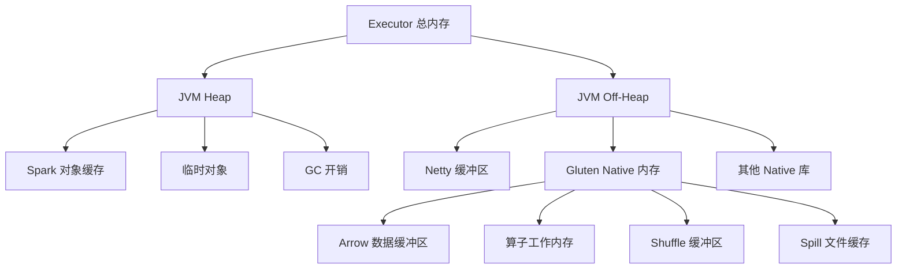
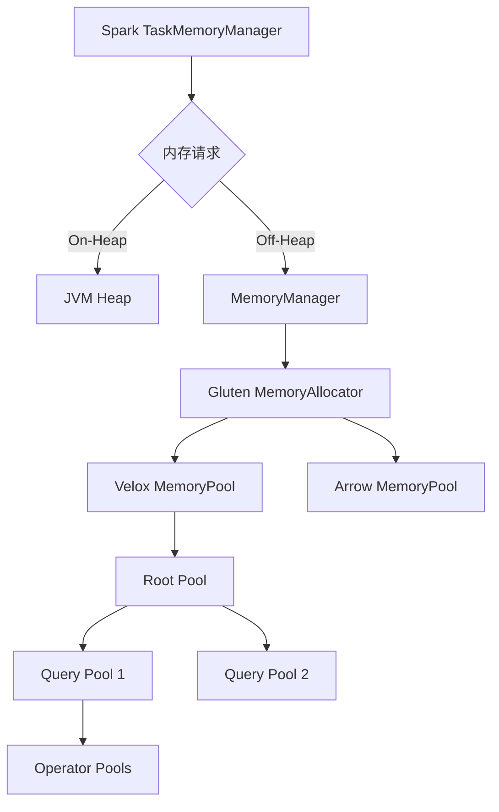

# 第6章：内存管理

> **本章要点**：
> - 理解 JVM 内存和 Native 内存的区别和协作
> - 掌握 Gluten 统一内存管理器的设计
> - 学习 Off-Heap 内存的配置和优化
> - 了解内存泄漏检测和调试技巧
> - 掌握内存溢出（Spill）机制

## 引言

内存管理是 Gluten 性能的关键。由于 Gluten 横跨 JVM 和 Native 两个世界，需要协调管理两侧的内存。配置不当会导致 OOM（Out Of Memory）、性能下降甚至任务失败。本章将深入剖析 Gluten 的内存管理机制。

## 6.1 JVM 内存 vs Native 内存

### 6.1.1 内存布局总览



### 6.1.2 内存分类详解

#### 1. JVM Heap 内存

**用途**：
- Spark Driver 和 Executor 的 Java 对象
- RDD 缓存（如果使用 `cache()`）
- Broadcast 变量
- 任务调度元数据

**特点**：
- 受 GC 管理
- 配置：`spark.executor.memory`
- 对象生命周期由 JVM 控制

**示例配置**：
```properties
spark.executor.memory=16g
spark.memory.fraction=0.6        # 60% 用于执行和存储
spark.memory.storageFraction=0.5 # 存储和执行各占一半
```

#### 2. JVM Off-Heap 内存

**用途**：
- Netty 网络缓冲区（Shuffle 传输）
- DirectByteBuffer 分配
- Gluten Native 内存

**特点**：
- 不受 GC 管理（减少 GC 压力）
- 需要手动释放（或依赖 Cleaner）
- 配置：`spark.memory.offHeap.size`

**示例配置**：
```properties
spark.memory.offHeap.enabled=true
spark.memory.offHeap.size=20g
```

#### 3. Gluten Native 内存

**用途**：
- Arrow 列式数据缓冲区
- Velox/ClickHouse 算子工作内存
- Hash 表、排序缓冲区
- Spill 文件缓存

**特点**：
- C++ 直接管理（malloc/free）
- 零拷贝数据传输
- 高性能，但需要精细控制

**配置**：
```properties
spark.gluten.memory.offHeap.size.in.bytes=21474836480  # 20GB
```

### 6.1.3 内存大小关系

推荐配置比例：

```
Executor 容器内存 = JVM Heap + Off-Heap + 系统预留

示例（40GB 容器）：
  - JVM Heap:          16 GB  (40%)
  - JVM Off-Heap:       2 GB  ( 5%, Netty 等)
  - Gluten Native:     20 GB  (50%)
  - 系统预留:           2 GB  ( 5%, OS cache, overhead)
```

配置示例：
```properties
# Kubernetes 资源请求
spark.kubernetes.executor.request.cores=8
spark.kubernetes.executor.request.memory=40g

# JVM 内存
spark.executor.memory=16g
spark.executor.memoryOverhead=4g  # 包含 Off-Heap

# Gluten Native 内存
spark.memory.offHeap.enabled=true
spark.memory.offHeap.size=20g
spark.gluten.memory.offHeap.size.in.bytes=21474836480
```

## 6.2 统一内存管理器设计

### 6.2.1 内存管理架构



### 6.2.2 MemoryAllocator 接口

Gluten 定义了统一的内存分配器接口：

```cpp
// gluten-core/src/main/cpp/memory/MemoryAllocator.h
namespace gluten {

class MemoryAllocator {
public:
  virtual ~MemoryAllocator() = default;
  
  // 分配内存
  virtual void* allocate(int64_t size) = 0;
  
  // 重新分配
  virtual void* reallocate(void* ptr, int64_t oldSize, int64_t newSize) = 0;
  
  // 释放内存
  virtual void free(void* ptr, int64_t size) = 0;
  
  // 获取已分配大小
  virtual int64_t getBytesAllocated() const = 0;
  
  // 获取峰值大小
  virtual int64_t getPeakBytesAllocated() const = 0;
  
  // 尝试预留内存
  virtual bool reserve(int64_t size) = 0;
  
  // 释放预留
  virtual void release(int64_t size) = 0;
};

} // namespace gluten
```

### 6.2.3 Velox MemoryPool 集成

Velox 使用分层的 MemoryPool：

```cpp
namespace facebook::velox::memory {

class MemoryPool {
public:
  // 分配内存
  void* allocate(int64_t size) {
    // 1. 尝试从当前 Pool 分配
    if (canAllocate(size)) {
      return allocateFromPool(size);
    }
    
    // 2. 尝试从父 Pool 获取配额
    if (parent_ && parent_->reserve(size)) {
      capacity_ += size;
      return allocateFromPool(size);
    }
    
    // 3. 触发 Spill
    if (trySpill(size)) {
      return allocateFromPool(size);
    }
    
    // 4. 分配失败
    throw std::bad_alloc();
  }
  
  // 释放内存
  void free(void* ptr, int64_t size) {
    freeToPool(ptr, size);
    
    // 如果空闲内存过多，返还给父 Pool
    if (shouldReturnToParent()) {
      returnToParent(excessCapacity());
    }
  }
  
  // 获取使用量
  int64_t getCurrentBytes() const {
    return usedBytes_;
  }
  
  // 获取峰值
  int64_t getPeakBytes() const {
    return peakBytes_;
  }

private:
  MemoryPool* parent_;           // 父 Pool
  int64_t capacity_;             // 容量
  int64_t usedBytes_;            // 已使用
  int64_t peakBytes_;            // 峰值
  
  std::map<void*, int64_t> allocations_; // 分配记录
};

} // namespace facebook::velox::memory
```

### 6.2.4 Gluten 到 Velox 的桥接

```cpp
// gluten-core/src/main/cpp/memory/VeloxMemoryAllocator.cpp
namespace gluten {

class VeloxMemoryAllocator : public MemoryAllocator {
public:
  VeloxMemoryAllocator(
    std::shared_ptr<velox::memory::MemoryPool> pool
  ) : pool_(pool) {}
  
  void* allocate(int64_t size) override {
    return pool_->allocate(size);
  }
  
  void free(void* ptr, int64_t size) override {
    pool_->free(ptr, size);
  }
  
  int64_t getBytesAllocated() const override {
    return pool_->getCurrentBytes();
  }
  
  int64_t getPeakBytesAllocated() const override {
    return pool_->getPeakBytes();
  }

private:
  std::shared_ptr<velox::memory::MemoryPool> pool_;
};

// 工厂方法
std::shared_ptr<MemoryAllocator> 
createVeloxAllocator(int64_t capacity) {
  // 创建 Root Pool
  auto rootPool = velox::memory::MemoryManager::getInstance()
    .addRootPool("gluten", capacity);
  
  return std::make_shared<VeloxMemoryAllocator>(rootPool);
}

} // namespace gluten
```

### 6.2.5 内存预留机制

Gluten 实现了与 Spark TaskMemoryManager 的集成：

```scala
// gluten-core/src/main/scala/io/glutenproject/memory/TaskMemoryManager.scala
class GlutenMemoryManager(
  taskMemoryManager: TaskMemoryManager,
  totalSize: Long
) {
  
  private val nativeAllocator = NativeMemoryAllocator.create(totalSize)
  
  // 申请内存
  def acquireMemory(size: Long): Boolean = {
    // 1. 从 Spark 申请配额
    val granted = taskMemoryManager.acquireExecutionMemory(
      size,
      MemoryMode.OFF_HEAP,
      null
    )
    
    if (granted >= size) {
      // 2. 通知 Native 层
      nativeAllocator.reserve(size)
      true
    } else {
      // 释放已获得的配额
      taskMemoryManager.releaseExecutionMemory(granted, MemoryMode.OFF_HEAP, null)
      false
    }
  }
  
  // 释放内存
  def releaseMemory(size: Long): Unit = {
    // 1. Native 层释放
    nativeAllocator.release(size)
    
    // 2. 归还 Spark 配额
    taskMemoryManager.releaseExecutionMemory(size, MemoryMode.OFF_HEAP, null)
  }
  
  // 获取使用情况
  def getMemoryUsage: MemoryUsage = {
    MemoryUsage(
      used = nativeAllocator.getBytesAllocated(),
      peak = nativeAllocator.getPeakBytesAllocated(),
      limit = totalSize
    )
  }
}
```

## 6.3 Off-Heap 内存配置

### 6.3.1 基础配置

**最简配置**：
```properties
# 启用 Off-Heap
spark.memory.offHeap.enabled=true
spark.memory.offHeap.size=20g

# Gluten Native 内存（应与 offHeap.size 一致）
spark.gluten.memory.offHeap.size.in.bytes=21474836480  # 20GB
```

### 6.3.2 内存隔离模式

Gluten 支持两种内存隔离模式：

#### 模式1：Shared（共享模式）

所有任务共享内存池：

```properties
spark.gluten.memory.isolation=false
spark.gluten.memory.offHeap.size.in.bytes=21474836480  # 20GB 总量
```

**优点**：
- 内存利用率高
- 适合任务数量波动的场景

**缺点**：
- 可能出现内存竞争
- 一个大任务可能占用过多内存

**适用场景**：
- 单个查询或少量并发查询
- 任务内存需求相对均衡

#### 模式2：Isolated（隔离模式）

每个任务独立的内存配额：

```properties
spark.gluten.memory.isolation=true
spark.gluten.memory.offHeap.size.in.bytes=21474836480  # 20GB 总量
spark.executor.cores=8                                  # 8 个核心
spark.task.cpus=1                                       # 每任务 1 核

# 每任务内存 = 20GB / 8 = 2.5GB
```

**优点**：
- 任务间相互隔离
- 避免内存抢占
- 更可预测的性能

**缺点**：
- 可能造成内存浪费
- 单个任务内存受限

**适用场景**：
- 高并发场景
- 多租户环境
- 需要严格 SLA 保证

### 6.3.3 内存配置计算

**配置公式**：

```
单 Executor 总内存 = executor.memory + memoryOverhead

Off-Heap 内存占比：
  推荐：50-70% 的总内存
  
计算示例（64GB 容器）：
  - executor.memory = 24GB (37.5%)
  - memoryOverhead = 8GB (12.5%)
  - Gluten Native = 32GB (50%)
  
  配置：
    spark.executor.memory=24g
    spark.executor.memoryOverhead=8g
    spark.memory.offHeap.size=32g
    spark.gluten.memory.offHeap.size.in.bytes=34359738368
```

**按工作负载调整**：

| 工作负载类型 | Off-Heap 占比 | 说明 |
|-------------|--------------|------|
| 简单过滤投影 | 40-50% | Native 处理较轻 |
| 复杂聚合 | 60-70% | 需要大量 Hash 表内存 |
| 多表 Join | 70-80% | Build 侧需要大内存 |
| 大规模 Shuffle | 50-60% | 平衡 Shuffle 和计算 |

### 6.3.4 内存配置模板

**小集群（每节点 32GB）**：
```properties
spark.executor.memory=12g
spark.executor.memoryOverhead=4g
spark.memory.offHeap.enabled=true
spark.memory.offHeap.size=16g
spark.gluten.memory.offHeap.size.in.bytes=17179869184
spark.executor.cores=4
```

**中等集群（每节点 64GB）**：
```properties
spark.executor.memory=24g
spark.executor.memoryOverhead=8g
spark.memory.offHeap.enabled=true
spark.memory.offHeap.size=32g
spark.gluten.memory.offHeap.size.in.bytes=34359738368
spark.executor.cores=8
```

**大集群（每节点 128GB）**：
```properties
spark.executor.memory=48g
spark.executor.memoryOverhead=16g
spark.memory.offHeap.enabled=true
spark.memory.offHeap.size=64g
spark.gluten.memory.offHeap.size.in.bytes=68719476736
spark.executor.cores=16
```

### 6.3.5 动态调整策略

使用自适应内存配置：

```scala
// 根据查询类型动态调整
object AdaptiveMemoryConfig {
  def recommendConfig(queryType: QueryType): MemoryConfig = {
    queryType match {
      case QueryType.OLAP_SCAN =>
        MemoryConfig(
          offHeapRatio = 0.5,
          isolationEnabled = false
        )
      
      case QueryType.COMPLEX_AGGREGATION =>
        MemoryConfig(
          offHeapRatio = 0.7,
          isolationEnabled = true
        )
      
      case QueryType.MULTI_JOIN =>
        MemoryConfig(
          offHeapRatio = 0.75,
          isolationEnabled = true
        )
      
      case QueryType.SHUFFLE_HEAVY =>
        MemoryConfig(
          offHeapRatio = 0.6,
          isolationEnabled = false
        )
    }
  }
}
```

## 6.4 内存泄漏检测和调试

### 6.4.1 内存泄漏的常见原因

1. **Arrow Buffer 未释放**
   ```cpp
   // 错误示例
   auto buffer = arrow::AllocateBuffer(1024);
   // 忘记释放！
   
   // 正确示例
   auto buffer = arrow::AllocateBuffer(1024);
   // ... 使用 buffer
   // 使用智能指针自动释放
   ```

2. **Velox Vector 持有引用**
   ```cpp
   // Vector 保持了对 Buffer 的引用
   auto vector = std::make_shared<FlatVector<int64_t>>(buffer);
   // 需要显式清空
   vector.reset();
   ```

3. **JNI 全局引用泄漏**
   ```cpp
   // 错误
   jobject globalRef = env->NewGlobalRef(obj);
   // 忘记删除！
   
   // 正确
   jobject globalRef = env->NewGlobalRef(obj);
   // ... 使用
   env->DeleteGlobalRef(globalRef);
   ```

### 6.4.2 内存监控工具

#### 1. Gluten 内存度量

```scala
// 获取内存使用情况
val memoryMetrics = GlutenMemoryMetrics.get()

println(s"Used: ${memoryMetrics.currentBytes / (1024 * 1024)} MB")
println(s"Peak: ${memoryMetrics.peakBytes / (1024 * 1024)} MB")
println(s"Limit: ${memoryMetrics.limitBytes / (1024 * 1024)} MB")

// 打印各 Pool 的使用情况
memoryMetrics.pools.foreach { pool =>
  println(s"Pool ${pool.name}: ${pool.currentBytes} bytes")
}
```

#### 2. Velox Memory Statistics

通过 Gluten UI 查看：
```
http://executor-ip:4040/gluten/memory

显示内容：
- Total Allocated: 18.5 GB
- Peak Allocated: 22.3 GB
- Allocation Count: 1,245,678
- Free Count: 1,245,670
- Active Allocations: 8
```

#### 3. JVM 内存监控

```bash
# 使用 jmap 查看堆使用
jmap -heap <executor-pid>

# 查看 DirectByteBuffer
jmap -histo <executor-pid> | grep Direct

# 生成 Heap Dump
jmap -dump:format=b,file=heap.bin <executor-pid>
```

### 6.4.3 使用 Valgrind 检测泄漏

**编译 Debug 版本**：
```bash
cd /path/to/gluten
mkdir build-debug
cd build-debug

cmake .. -DCMAKE_BUILD_TYPE=Debug
make -j$(nproc)
```

**运行 Valgrind**：
```bash
# 设置环境变量使用 Debug 库
export LD_LIBRARY_PATH=/path/to/gluten/build-debug/lib:$LD_LIBRARY_PATH

# 启动 Spark 任务（本地模式）
valgrind \
  --leak-check=full \
  --show-leak-kinds=all \
  --track-origins=yes \
  --log-file=valgrind.log \
  spark-submit \
    --master local[1] \
    --conf spark.plugins=org.apache.gluten.GlutenPlugin \
    --class MyApp \
    my-app.jar
```

**分析输出**：
```
==12345== LEAK SUMMARY:
==12345==    definitely lost: 4,096 bytes in 2 blocks
==12345==    indirectly lost: 8,192 bytes in 4 blocks
==12345==    possibly lost: 0 bytes in 0 blocks
==12345==    still reachable: 1,024 bytes in 1 blocks
==12345==    suppressed: 0 bytes in 0 blocks
```

### 6.4.4 使用 AddressSanitizer (ASan)

**编译 ASan 版本**：
```bash
cmake .. \
  -DCMAKE_BUILD_TYPE=Debug \
  -DCMAKE_CXX_FLAGS="-fsanitize=address -fno-omit-frame-pointer" \
  -DCMAKE_EXE_LINKER_FLAGS="-fsanitize=address"

make -j$(nproc)
```

**运行**：
```bash
ASAN_OPTIONS=detect_leaks=1:halt_on_error=0 \
  spark-submit \
    --master local[1] \
    --conf spark.plugins=org.apache.gluten.GlutenPlugin \
    --class MyApp \
    my-app.jar
```

**ASan 会检测**：
- 内存泄漏
- Use-after-free
- Buffer overflow
- Double free

### 6.4.5 内存泄漏调试示例

**问题**：任务运行一段时间后 OOM

**排查步骤**：

1. **监控内存增长**：
   ```bash
   # 每 5 秒输出内存使用
   while true; do
     curl -s http://executor-ip:4040/gluten/metrics | \
       jq '.memoryUsage'
     sleep 5
   done
   ```

2. **分析日志**：
   ```bash
   grep "OutOfMemory" executor.log
   grep "MemoryPool" executor.log | tail -100
   ```

3. **Dump 内存状态**：
   ```scala
   // 在代码中添加监控
   if (memoryUsage > threshold) {
     dumpMemoryState("/tmp/memory-dump.txt")
   }
   ```

4. **定位泄漏代码**：
   ```cpp
   // 添加日志追踪分配
   void* allocate(int64_t size) {
     void* ptr = malloc(size);
     LOG(INFO) << "Allocated " << size << " bytes at " << ptr
               << " from " << __FILE__ << ":" << __LINE__;
     return ptr;
   }
   ```

## 6.5 内存溢出（Spill）机制

### 6.5.1 Spill 触发条件

当内存不足时，算子会将数据溢出到磁盘：

```cpp
class Operator {
  void processInput(RowVector* input) {
    // 尝试分配内存
    void* buffer = pool_->allocate(requiredSize);
    
    if (buffer == nullptr) {
      // 触发 Spill
      spill();
      
      // 重试分配
      buffer = pool_->allocate(requiredSize);
      
      if (buffer == nullptr) {
        throw std::bad_alloc();
      }
    }
    
    // 处理数据
    process(input, buffer);
  }
  
  void spill() {
    // 1. 选择要溢出的数据（通常是最大的 Partition）
    auto victimPartition = selectVictim();
    
    // 2. 写入磁盘
    spillPartition(victimPartition);
    
    // 3. 释放内存
    freePartition(victimPartition);
  }
};
```

### 6.5.2 HashAggregate Spill

```cpp
class HashAggregateOperator {
private:
  // 分区数量（通常是 2 的幂）
  static constexpr int kNumPartitions = 32;
  
  // 每个分区的 Hash 表
  std::array<HashTable, kNumPartitions> partitions_;
  
  // 已溢出的分区
  std::vector<SpilledPartition> spilledPartitions_;
  
  void addInput(RowVector* input) {
    for (size_t i = 0; i < input->size(); ++i) {
      // 计算分区ID
      auto partitionId = hashPartition(input, i) % kNumPartitions;
      
      // 尝试插入
      if (!partitions_[partitionId].insert(input, i)) {
        // 内存不足，溢出一个分区
        spillLargestPartition();
        
        // 重试
        if (!partitions_[partitionId].insert(input, i)) {
          throw std::runtime_error("Unable to insert after spill");
        }
      }
    }
  }
  
  void spillLargestPartition() {
    // 1. 找到最大的分区
    size_t largestIdx = 0;
    size_t largestSize = 0;
    
    for (size_t i = 0; i < kNumPartitions; ++i) {
      size_t size = partitions_[i].memoryUsage();
      if (size > largestSize && !partitions_[i].isSpilled()) {
        largestSize = size;
        largestIdx = i;
      }
    }
    
    if (largestSize == 0) {
      throw std::runtime_error("No partition to spill");
    }
    
    // 2. 创建溢出文件
    auto spillFile = createSpillFile();
    
    // 3. 写入数据
    auto& partition = partitions_[largestIdx];
    partition.forEach([&](const auto& key, const auto& value) {
      spillFile->write(key, value);
    });
    
    spillFile->close();
    
    // 4. 清空内存中的分区
    size_t freedBytes = partition.memoryUsage();
    partition.clear();
    
    // 5. 记录溢出信息
    spilledPartitions_.push_back({
      .partitionId = largestIdx,
      .filePath = spillFile->path(),
      .numRows = spillFile->numRows()
    });
    
    LOG(INFO) << "Spilled partition " << largestIdx
              << ", freed " << freedBytes << " bytes";
  }
  
  RowVectorPtr getOutput() {
    RowVectorPtr result;
    
    // 1. 输出内存中的分区
    for (auto& partition : partitions_) {
      if (!partition.isEmpty() && !partition.isSpilled()) {
        result = partition.getOutput();
        if (result) return result;
      }
    }
    
    // 2. 处理溢出的分区（需要重新加载）
    for (auto& spilledPart : spilledPartitions_) {
      result = processSpilledPartition(spilledPart);
      if (result) return result;
    }
    
    return nullptr; // 所有数据已输出
  }
  
  RowVectorPtr processSpilledPartition(const SpilledPartition& spilled) {
    // 1. 读取溢出文件
    auto reader = SpillFileReader::open(spilled.filePath);
    
    // 2. 重建 Hash 表
    HashTable tempTable;
    while (auto batch = reader->read()) {
      for (size_t i = 0; i < batch->size(); ++i) {
        tempTable.insert(batch, i);
      }
    }
    
    // 3. 输出结果
    return tempTable.getOutput();
  }
};
```

### 6.5.3 HashJoin Spill

```cpp
class HashJoinOperator {
private:
  // Build 侧 Hash 表
  std::unique_ptr<HashTable> buildTable_;
  
  // 溢出的 Build 侧分区
  std::vector<SpilledPartition> spilledBuildPartitions_;
  
  // 溢出的 Probe 侧分区
  std::vector<SpilledPartition> spilledProbePartitions_;
  
  void buildHashTable(RowVector* buildInput) {
    // 尝试构建 Hash 表
    try {
      buildTable_->insert(buildInput);
    } catch (const std::bad_alloc&) {
      // 内存不足，使用分区策略
      spillPartitionedBuild(buildInput);
    }
  }
  
  void spillPartitionedBuild(RowVector* buildInput) {
    // 1. 分区并溢出 Build 侧
    for (size_t i = 0; i < kNumPartitions; ++i) {
      auto partition = extractPartition(buildInput, i);
      spillBuildPartition(i, partition);
    }
    
    // 2. 同时需要分区并溢出 Probe 侧
    spillProbePartitions_ = true;
  }
  
  RowVectorPtr probe(RowVector* probeInput) {
    if (!spillProbePartitions_) {
      // 正常 Probe
      return buildTable_->probe(probeInput);
    } else {
      // 分区 Probe
      for (size_t i = 0; i < kNumPartitions; ++i) {
        auto partition = extractPartition(probeInput, i);
        spillProbePartition(i, partition);
      }
      return nullptr; // 稍后处理
    }
  }
  
  RowVectorPtr processSpilledJoin() {
    // 对每个分区执行 Join
    for (size_t i = 0; i < spilledBuildPartitions_.size(); ++i) {
      // 1. 加载 Build 侧分区
      auto buildData = loadSpilledPartition(spilledBuildPartitions_[i]);
      HashTable tempTable;
      tempTable.insert(buildData);
      
      // 2. 加载并 Probe Probe 侧分区
      auto probeData = loadSpilledPartition(spilledProbePartitions_[i]);
      auto result = tempTable.probe(probeData);
      
      if (result && result->size() > 0) {
        return result;
      }
    }
    
    return nullptr;
  }
};
```

### 6.5.4 Spill 配置

```properties
# 启用 Spill
spark.gluten.sql.columnar.backend.velox.spillEnabled=true

# Spill 目录（支持多个，逗号分隔）
spark.gluten.sql.columnar.backend.velox.spillPath=/data1/spill,/data2/spill

# Spill 阈值（内存使用率达到 80% 开始 Spill）
spark.gluten.sql.columnar.backend.velox.spillThreshold=0.8

# Spill 文件大小（单位：字节）
spark.gluten.sql.columnar.backend.velox.spillFileSize=1073741824  # 1GB

# Spill 压缩编码
spark.gluten.sql.columnar.backend.velox.spillCompressionCodec=lz4

# 最大 Spill 级别（递归 Spill 的层数）
spark.gluten.sql.columnar.backend.velox.maxSpillLevel=3
```

### 6.5.5 监控 Spill 情况

通过 Spark UI 查看：

```scala
// Spark 任务的 Metrics
val metrics = taskContext.taskMetrics()

println(s"Memory Bytes Spilled: ${metrics.memoryBytesSpilled}")
println(s"Disk Bytes Spilled: ${metrics.diskBytesSpilled}")
```

通过 Gluten UI 查看：
```
http://executor-ip:4040/gluten/spill

显示内容：
- Total Spilled Data: 15.3 GB
- Spill Files: 248
- Spill Operations: 1,234
- Average Spill Time: 120 ms
```

### 6.5.6 优化 Spill 性能

1. **增加内存**（减少 Spill）：
   ```properties
   spark.memory.offHeap.size=64g  # 增大内存
   ```

2. **使用快速磁盘**（SSD）：
   ```properties
   spark.gluten.sql.columnar.backend.velox.spillPath=/ssd/spill
   ```

3. **增加分区数**（减少单分区大小）：
   ```properties
   spark.sql.shuffle.partitions=400  # 增加分区数
   ```

4. **启用压缩**：
   ```properties
   spark.gluten.sql.columnar.backend.velox.spillCompressionCodec=zstd
   ```

## 本章小结

本章深入学习了 Gluten 的内存管理：

1. ✅ **JVM vs Native**：理解了两种内存的区别和协作
2. ✅ **统一管理器**：掌握了 Gluten 的内存分配器设计
3. ✅ **Off-Heap 配置**：学习了如何正确配置和调优 Off-Heap 内存
4. ✅ **泄漏检测**：掌握了使用 Valgrind、ASan 等工具调试内存问题
5. ✅ **Spill 机制**：理解了内存溢出的原理和优化方法

下一章我们将学习数据格式与传输，了解 Gluten 如何高效地在 JVM 和 Native 之间传递数据。

## 参考资料

- [Spark Memory Management](https://spark.apache.org/docs/latest/tuning.html#memory-management-overview)
- [Velox Memory Management](https://facebookincubator.github.io/velox/develop/arena.html)
- [Apache Arrow Memory Pool](https://arrow.apache.org/docs/cpp/memory.html)
- [Valgrind User Manual](https://valgrind.org/docs/manual/manual.html)

---

**下一章预告**：[第7章：数据格式与传输](chapter07-data-format-and-transfer.md) - 深入 Arrow 格式和 JNI 数据传输
