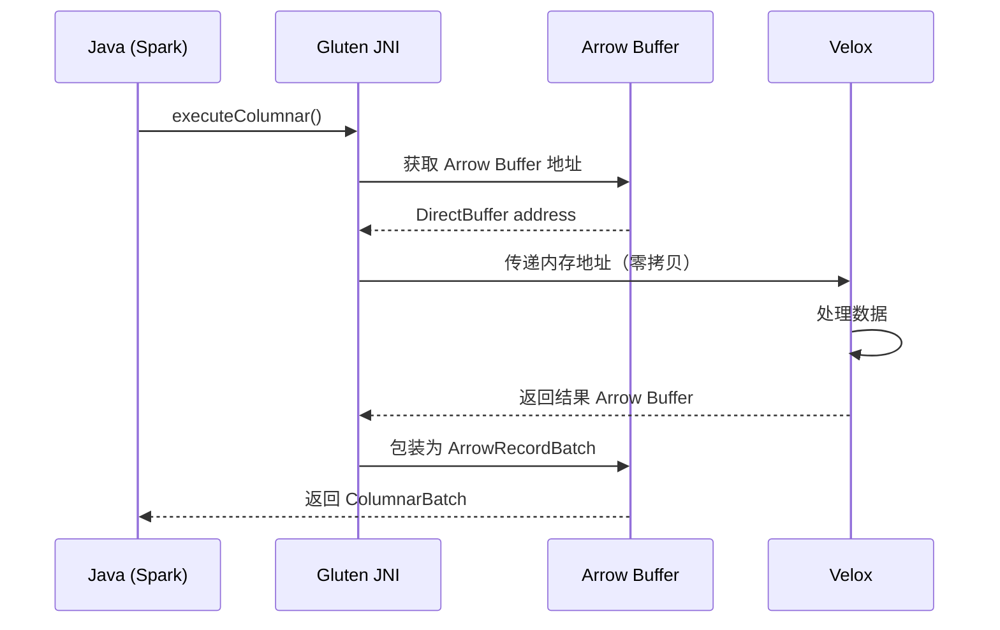

# 第7章：数据格式与传输

> **本章要点**：
> - 深入理解 Apache Arrow 列式数据格式
> - 掌握 Columnar Batch 的内存布局和设计
> - 学习 JNI 数据传输的零拷贝优化
> - 理解序列化与反序列化的性能影响
> - 掌握数据格式转换的最佳实践

## 引言

数据格式与传输是 Gluten 性能的另一个关键因素。Gluten 使用 Apache Arrow 作为标准的列式内存格式，实现了 JVM 和 Native 之间的高效数据传输。本章将深入剖析这些技术细节。

## 7.1 Apache Arrow 数据格式

### 7.1.1 Arrow 设计理念

**核心目标**：
- 📦 **标准化**：跨语言、跨平台的统一格式
- 🚀 **零拷贝**：进程间共享数据无需序列化
- 💾 **缓存友好**：列式布局利于 CPU 缓存
- 🔧 **可扩展**：支持复杂嵌套类型

### 7.1.2 Arrow 内存布局

#### 基本结构

```
Array (列)
  ├─ Type (数据类型)
  ├─ Length (长度)
  ├─ Null Count (空值数量)
  ├─ Validity Buffer (空值位图，可选)
  └─ Data Buffer(s) (数据缓冲区，1个或多个)
```

#### Primitive Types (基础类型)

**Int32 Array 示例**：

```
Length: 5
Null Count: 1
Values: [1, null, 3, 4, 5]

内存布局：
┌─────────────────────────────────┐
│ Validity Buffer (1 byte)        │
│ [1, 0, 1, 1, 1, 0, 0, 0]        │ ← 位图，1 = non-null, 0 = null
├─────────────────────────────────┤
│ Data Buffer (20 bytes)          │
│ [1, ?, 3, 4, 5]                 │ ← Int32 值（? = 未定义）
└─────────────────────────────────┘
```

**C++ 表示**：
```cpp
#include <arrow/array.h>

// 创建 Int32Array
arrow::Int32Builder builder;
builder.Append(1);
builder.AppendNull();
builder.Append(3);
builder.Append(4);
builder.Append(5);

std::shared_ptr<arrow::Int32Array> array;
builder.Finish(&array);

// 访问数据
for (int64_t i = 0; i < array->length(); ++i) {
  if (array->IsNull(i)) {
    std::cout << "null ";
  } else {
    std::cout << array->Value(i) << " ";
  }
}
// 输出: 1 null 3 4 5
```

**String Array 示例**：

```
Length: 3
Values: ["hello", "world", "arrow"]

内存布局：
┌─────────────────────────────────┐
│ Validity Buffer (1 byte)        │
│ [1, 1, 1, 0, 0, 0, 0, 0]        │
├─────────────────────────────────┤
│ Offsets Buffer (16 bytes)       │
│ [0, 5, 10, 15]                  │ ← 每个字符串的起始位置
├─────────────────────────────────┤
│ Data Buffer (15 bytes)          │
│ "helloworldarrow"               │ ← 连续存储的字符
└─────────────────────────────────┘
```

**访问 String**：
```cpp
std::shared_ptr<arrow::StringArray> strArray = ...;

for (int64_t i = 0; i < strArray->length(); ++i) {
  if (!strArray->IsNull(i)) {
    arrow::util::string_view str = strArray->GetView(i);
    std::cout << str << std::endl;
  }
}
```

#### Nested Types (嵌套类型)

**List Array 示例**：

```
Type: List<Int32>
Values: [[1, 2, 3], null, [4, 5]]

内存布局：
┌─────────────────────────────────┐
│ Validity Buffer                 │
│ [1, 0, 1, 0, 0, 0, 0, 0]        │
├─────────────────────────────────┤
│ Offsets Buffer                  │
│ [0, 3, 3, 5]                    │ ← 每个列表的起始位置
├─────────────────────────────────┤
│ Values Array (Int32Array)       │
│   Validity: [1, 1, 1, 1, 1]    │
│   Data: [1, 2, 3, 4, 5]        │
└─────────────────────────────────┘
```

**Struct Array 示例**：

```
Type: Struct<name: String, age: Int32>
Values: [
  {"name": "Alice", "age": 30},
  {"name": "Bob", "age": 25},
  null
]

内存布局：
┌─────────────────────────────────┐
│ Validity Buffer                 │
│ [1, 1, 0, 0, 0, 0, 0, 0]        │
├─────────────────────────────────┤
│ name Field (StringArray)        │
│   ["Alice", "Bob", ?]           │
├─────────────────────────────────┤
│ age Field (Int32Array)          │
│   [30, 25, ?]                   │
└─────────────────────────────────┘
```

### 7.1.3 Arrow Schema

Schema 定义了列的类型和元数据：

```cpp
#include <arrow/type.h>

// 创建 Schema
auto schema = arrow::schema({
  arrow::field("id", arrow::int64()),
  arrow::field("name", arrow::utf8()),
  arrow::field("age", arrow::int32()),
  arrow::field("score", arrow::float64()),
  arrow::field("tags", arrow::list(arrow::utf8()))
});

// 访问字段
for (const auto& field : schema->fields()) {
  std::cout << field->name() << ": " 
            << field->type()->ToString() << std::endl;
}

/* 输出:
id: int64
name: string
age: int32
score: double
tags: list<string>
*/
```

### 7.1.4 RecordBatch

RecordBatch 是一组具有相同长度的 Arrays：

```cpp
// 创建 RecordBatch
auto id_array = ... ;     // Int64Array
auto name_array = ...;    // StringArray
auto age_array = ...;     // Int32Array

auto batch = arrow::RecordBatch::Make(
  schema,
  /*num_rows=*/1000,
  {id_array, name_array, age_array}
);

// 访问列
std::shared_ptr<arrow::Array> column = batch->column(0);

// 转换为 Slice
auto slice = batch->Slice(100, 50); // 从第 100 行开始，取 50 行

// 序列化
arrow::io::BufferOutputStream stream;
arrow::ipc::RecordBatchWriter::Make(&stream, schema)->WriteRecordBatch(*batch);
```

### 7.1.5 Arrow 的性能优势

**对比传统行式格式**：

| 特性 | 行式（Row-based） | 列式（Arrow） |
|------|------------------|--------------|
| 数据布局 | [行1所有列, 行2所有列, ...] | [列1所有行, 列2所有行, ...] |
| 缓存利用 | 差（加载无关列） | 好（只加载需要的列） |
| SIMD 优化 | 难（数据不连续） | 易（数据连续） |
| 压缩比 | 低（列之间数据类型不同） | 高（同类型数据连续） |
| 投影性能 | 慢（需要解析整行） | 快（直接访问列） |

**性能测试**：

```cpp
// 行式存储：扫描 1 亿行，投影 2 列
struct Row {
  int64_t id;
  char name[100];
  int32_t age;
  double score;
};
Row* rows = new Row[100000000];

auto start = std::chrono::high_resolution_clock::now();
int64_t sum = 0;
for (int64_t i = 0; i < 100000000; ++i) {
  sum += rows[i].id;  // 只需要 id，但加载了整行
}
auto end = std::chrono::high_resolution_clock::now();
// 耗时约 800 ms

// 列式存储（Arrow）：只加载 id 列
auto id_column = batch->column(0);
auto id_array = std::static_pointer_cast<arrow::Int64Array>(id_column);

start = std::chrono::high_resolution_clock::now();
sum = 0;
for (int64_t i = 0; i < id_array->length(); ++i) {
  sum += id_array->Value(i);
}
end = std::chrono::high_resolution_clock::now();
// 耗时约 150 ms（提升 5.3x）
```

## 7.2 Columnar Batch 设计

### 7.2.1 Spark ColumnarBatch

Spark 3.x 引入了 Columnar API：

```scala
// Spark ColumnarBatch
class ColumnarBatch(
  val columns: Array[ColumnVector],
  val numRows: Int
) {
  // 访问列
  def column(ordinal: Int): ColumnVector = columns(ordinal)
  
  // 行迭代器
  def rowIterator(): Iterator[InternalRow]
  
  // 列式执行
  def toColumnarBatch: ColumnarBatch = this
}

// ColumnVector 抽象
abstract class ColumnVector extends AutoCloseable {
  def getBoolean(rowId: Int): Boolean
  def getInt(rowId: Int): Int
  def getLong(rowId: Int): Long
  def getDouble(rowId: Int): Double
  def getUTF8String(rowId: Int): UTF8String
  
  def isNullAt(rowId: Int): Boolean
  
  // 批量访问
  def getInts(rowId: Int, count: Int): Array[Int]
}
```

### 7.2.2 Gluten ColumnarBatch 实现

Gluten 使用 Arrow 作为底层实现：

```scala
// gluten-core/src/main/scala/io/glutenproject/vectorized/ArrowColumnarBatch.scala
class ArrowColumnarBatch(
  val schema: StructType,
  val root: ArrowRecordBatch  // Native Arrow RecordBatch
) extends ColumnarBatch {
  
  // 列数量
  override def numCols: Int = schema.length
  
  // 行数量
  override def numRows: Int = root.getLength
  
  // 访问列
  override def column(ordinal: Int): ColumnVector = {
    new ArrowColumnVector(root.getVector(ordinal))
  }
  
  // 释放内存
  override def close(): Unit = {
    if (root != null) {
      root.close()
    }
  }
  
  // 导出为 Arrow
  def exportAsArrow(): ArrowRecordBatch = root
}
```

### 7.2.3 ArrowColumnVector

```scala
class ArrowColumnVector(
  val vector: ArrowFieldVector  // Native Arrow Vector
) extends ColumnVector {
  
  override def isNullAt(rowId: Int): Boolean = {
    vector.isNull(rowId)
  }
  
  override def getInt(rowId: Int): Int = {
    vector.getInt(rowId)
  }
  
  override def getLong(rowId: Int): Long = {
    vector.getLong(rowId)
  }
  
  override def getDouble(rowId: Int): Double = {
    vector.getDouble(rowId)
  }
  
  override def getUTF8String(rowId: Int): UTF8String = {
    val bytes = vector.getBinary(rowId)
    UTF8String.fromBytes(bytes)
  }
  
  // 批量访问（零拷贝）
  override def getInts(rowId: Int, count: Int): Array[Int] = {
    vector.getIntArray(rowId, count)
  }
  
  override def close(): Unit = {
    vector.close()
  }
}
```

### 7.2.4 Native 侧 ArrowRecordBatch

```cpp
// gluten-core/src/main/cpp/jni/ArrowRecordBatch.cpp
namespace gluten {

class ArrowRecordBatch {
public:
  ArrowRecordBatch(std::shared_ptr<arrow::RecordBatch> batch)
    : batch_(batch) {}
  
  // 获取长度
  int64_t getLength() const {
    return batch_->num_rows();
  }
  
  // 获取列数
  int32_t getNumColumns() const {
    return batch_->num_columns();
  }
  
  // 获取列向量
  std::shared_ptr<ArrowFieldVector> getVector(int32_t ordinal) {
    auto array = batch_->column(ordinal);
    return std::make_shared<ArrowFieldVector>(array);
  }
  
  // 转换为 Velox RowVector
  velox::RowVectorPtr toVeloxRowVector() {
    return veloxFromArrow(batch_);
  }
  
  // 从 Velox RowVector 创建
  static std::shared_ptr<ArrowRecordBatch> 
  fromVeloxRowVector(const velox::RowVectorPtr& rowVector) {
    auto arrowBatch = arrowFromVelox(rowVector);
    return std::make_shared<ArrowRecordBatch>(arrowBatch);
  }

private:
  std::shared_ptr<arrow::RecordBatch> batch_;
};

} // namespace gluten
```

## 7.3 JNI 数据传输机制

### 7.3.1 JNI 基础回顾

**JNI 调用流程**：

```
Java 层
  ↓ (JNI Call)
Native 层 (C++)
  ↓ (Process)
返回 Java 层
```

**传统 JNI 数据传递（低效）**：

```java
// Java 侧
int[] data = new int[1000000];
nativeProcess(data);  // 需要拷贝！

// C++ 侧
JNIEXPORT void JNICALL
Java_MyClass_nativeProcess(JNIEnv* env, jclass, jintArray data) {
  // 1. 拷贝到 Native（慢！）
  jint* elements = env->GetIntArrayElements(data, nullptr);
  
  // 2. 处理
  for (int i = 0; i < 1000000; ++i) {
    elements[i] *= 2;
  }
  
  // 3. 拷贝回 Java（慢！）
  env->ReleaseIntArrayElements(data, elements, 0);
}
```

**问题**：
- ❌ 两次内存拷贝（Java → Native → Java）
- ❌ 大数据集性能差
- ❌ 增加 GC 压力

### 7.3.2 零拷贝传输：Direct Buffer

**DirectByteBuffer**：

```java
// Java 侧：分配堆外内存
ByteBuffer buffer = ByteBuffer.allocateDirect(4000000); // 1M ints
IntBuffer intBuffer = buffer.asIntBuffer();

// 填充数据
for (int i = 0; i < 1000000; ++i) {
  intBuffer.put(i);
}

// 传递给 Native（零拷贝！）
nativeProcessDirect(buffer);
```

```cpp
// C++ 侧：直接访问
JNIEXPORT void JNICALL
Java_MyClass_nativeProcessDirect(JNIEnv* env, jclass, jobject buffer) {
  // 获取 Direct Buffer 的地址（零拷贝！）
  void* address = env->GetDirectBufferAddress(buffer);
  jlong capacity = env->GetDirectBufferCapacity(buffer);
  
  // 直接操作内存
  int32_t* data = static_cast<int32_t*>(address);
  for (int64_t i = 0; i < capacity / 4; ++i) {
    data[i] *= 2;
  }
}
```

**优点**：
- ✅ 零拷贝
- ✅ 高性能
- ✅ JVM 和 Native 共享内存

### 7.3.3 Gluten 的零拷贝实现

**架构**：



**实现代码**：

```scala
// Scala 侧
class ColumnarNativeOperator extends Serializable {
  
  // 执行列式操作
  def execute(input: Iterator[ColumnarBatch]): Iterator[ColumnarBatch] = {
    input.flatMap { batch =>
      // 1. 转换为 Arrow
      val arrowBatch = batch.asInstanceOf[ArrowColumnarBatch]
      
      // 2. 导出 Arrow Schema 和 Buffers
      val schema = arrowBatch.exportSchemaAddress()
      val buffers = arrowBatch.exportBufferAddresses()
      
      // 3. 调用 Native 处理（零拷贝！）
      val resultHandle = NativeLibrary.executeOperator(
        operatorId,
        schema,
        buffers
      )
      
      // 4. 包装结果
      val resultBatch = ArrowColumnarBatch.fromHandle(resultHandle)
      Iterator(resultBatch)
    }
  }
}
```

```cpp
// C++ 侧
extern "C" JNIEXPORT jlong JNICALL
Java_NativeLibrary_executeOperator(
  JNIEnv* env,
  jclass,
  jlong operatorId,
  jlong schemaAddress,
  jlongArray bufferAddresses
) {
  // 1. 重建 Arrow RecordBatch（零拷贝！）
  auto schema = reinterpret_cast<arrow::Schema*>(schemaAddress);
  
  jlong* bufferAddrs = env->GetLongArrayElements(bufferAddresses, nullptr);
  std::vector<std::shared_ptr<arrow::Buffer>> buffers;
  for (int i = 0; i < env->GetArrayLength(bufferAddresses); ++i) {
    buffers.push_back(
      arrow::Buffer::Wrap(reinterpret_cast<uint8_t*>(bufferAddrs[i]), /*size*/)
    );
  }
  env->ReleaseLongArrayElements(bufferAddresses, bufferAddrs, JNI_ABORT);
  
  auto recordBatch = arrow::RecordBatch::Make(schema, buffers);
  
  // 2. 转换为 Velox
  auto rowVector = veloxFromArrow(recordBatch);
  
  // 3. 执行算子
  auto result = executeVeloxOperator(operatorId, rowVector);
  
  // 4. 转换回 Arrow
  auto resultBatch = arrowFromVelox(result);
  
  // 5. 返回句柄
  return reinterpret_cast<jlong>(new ArrowRecordBatch(resultBatch));
}
```

### 7.3.4 内存生命周期管理

**关键问题**：谁负责释放内存？

**Gluten 的策略**：

```cpp
class ManagedBuffer {
public:
  ManagedBuffer(uint8_t* data, int64_t size, std::function<void()> deleter)
    : data_(data), size_(size), deleter_(deleter) {}
  
  ~ManagedBuffer() {
    if (deleter_) {
      deleter_();
    }
  }
  
  uint8_t* data() { return data_; }
  int64_t size() { return size_; }

private:
  uint8_t* data_;
  int64_t size_;
  std::function<void()> deleter_;
};

// 创建从 Java DirectBuffer 引用的 Arrow Buffer
std::shared_ptr<arrow::Buffer> wrapJavaBuffer(
  JNIEnv* env,
  jobject javaBuffer
) {
  void* address = env->GetDirectBufferAddress(javaBuffer);
  jlong capacity = env->GetDirectBufferCapacity(javaBuffer);
  
  // 创建全局引用，防止 GC
  jobject globalRef = env->NewGlobalRef(javaBuffer);
  
  // 创建 Buffer，指定删除器
  return arrow::Buffer::FromBuffer(
    arrow::Buffer::Wrap(static_cast<uint8_t*>(address), capacity),
    [globalRef, env]() {
      // 释放时删除全局引用
      env->DeleteGlobalRef(globalRef);
    }
  );
}
```

### 7.3.5 性能对比

**测试场景**：传输 1GB 数据（250M 个 Int32）

| 方法 | 传输时间 | 内存拷贝 | CPU 使用 |
|------|---------|---------|---------|
| JNI Array (拷贝) | ~800 ms | 2 次 | 高 |
| DirectBuffer (零拷贝) | ~5 ms | 0 次 | 低 |
| **加速比** | **160x** | **∞** | **显著降低** |

## 7.4 序列化与反序列化

### 7.4.1 Arrow IPC 格式

**Arrow IPC**：Arrow 的序列化格式

```cpp
// 序列化 RecordBatch
arrow::Result<std::shared_ptr<arrow::Buffer>> 
serializeRecordBatch(const arrow::RecordBatch& batch) {
  auto buffer_output_stream = arrow::io::BufferOutputStream::Create();
  
  auto writer = arrow::ipc::MakeStreamWriter(
    buffer_output_stream->get(),
    batch.schema()
  );
  
  writer->WriteRecordBatch(batch);
  writer->Close();
  
  return buffer_output_stream->Finish();
}

// 反序列化
arrow::Result<std::shared_ptr<arrow::RecordBatch>> 
deserializeRecordBatch(const std::shared_ptr<arrow::Buffer>& buffer) {
  auto buffer_reader = std::make_shared<arrow::io::BufferReader>(buffer);
  
  auto reader = arrow::ipc::RecordBatchStreamReader::Open(buffer_reader);
  
  std::shared_ptr<arrow::RecordBatch> batch;
  reader->ReadNext(&batch);
  
  return batch;
}
```

**格式特点**：
- ✅ 快速（无需解析，直接映射）
- ✅ 零拷贝（可以mmap文件）
- ✅ 可流式处理

### 7.4.2 Shuffle 中的序列化

```scala
// Gluten Columnar Shuffle Writer
class ColumnarShuffleWriter[K, V](
  handle: ShuffleHandle,
  mapId: Long,
  context: TaskContext
) extends ShuffleWriter[K, V] {
  
  override def write(records: Iterator[Product2[K, V]]): Unit = {
    records.foreach {
      case (_, batch: ColumnarBatch) =>
        // 1. 分区
        val partitions = partitionBatch(batch)
        
        // 2. 序列化每个分区
        partitions.foreach { case (partId, partBatch) =>
          val serialized = serializeBatch(partBatch)
          writeToFile(partId, serialized)
        }
    }
  }
  
  private def serializeBatch(batch: ColumnarBatch): Array[Byte] = {
    val arrowBatch = batch.asInstanceOf[ArrowColumnarBatch]
    
    // Arrow IPC 序列化
    val stream = new ByteArrayOutputStream()
    val writer = new ArrowStreamWriter(
      arrowBatch.root,
      /*DictionaryProvider=*/null,
      stream
    )
    
    writer.writeBatch()
    writer.close()
    
    stream.toByteArray
  }
}
```

### 7.4.3 压缩优化

**列式数据的压缩**：

```cpp
#include <arrow/ipc/writer.h>
#include <arrow/util/compression.h>

// 使用 LZ4 压缩
auto codec = arrow::util::Codec::Create(arrow::Compression::LZ4).ValueOrDie();

arrow::ipc::IpcWriteOptions options;
options.codec = codec;

auto writer = arrow::ipc::MakeStreamWriter(output, schema, options);
writer->WriteRecordBatch(batch);
```

**压缩比对比**：

| 编码 | 压缩比 | 压缩速度 | 解压速度 | 适用场景 |
|------|-------|---------|---------|---------|
| 无压缩 | 1.0x | - | - | 低延迟 |
| LZ4 | 2.5x | 500 MB/s | 2000 MB/s | 平衡 |
| ZSTD | 3.5x | 200 MB/s | 800 MB/s | 高压缩比 |
| Snappy | 2.0x | 600 MB/s | 1500 MB/s | 快速 |

**推荐配置**：
```properties
# Shuffle 压缩
spark.shuffle.compress=true
spark.gluten.sql.columnar.shuffle.codec=lz4

# Spill 压缩
spark.gluten.sql.columnar.backend.velox.spillCompressionCodec=lz4
```

## 本章小结

本章深入学习了数据格式与传输：

1. ✅ **Arrow 格式**：掌握了 Arrow 列式内存布局和设计
2. ✅ **Columnar Batch**：理解了 Spark 列式 API 和 Gluten 的实现
3. ✅ **JNI 零拷贝**：学习了使用 DirectBuffer 实现零拷贝传输
4. ✅ **序列化优化**：掌握了 Arrow IPC 和压缩技术
5. ✅ **性能优化**：了解了零拷贝、共享内存等高级优化

下一章我们将学习 Columnar Shuffle，了解 Gluten 如何优化 Spark 的 Shuffle 性能。

## 参考资料

- [Apache Arrow Specification](https://arrow.apache.org/docs/format/Columnar.html)
- [Arrow Java Memory Management](https://arrow.apache.org/docs/java/memory.html)
- [JNI Specification](https://docs.oracle.com/javase/8/docs/technotes/guides/jni/spec/jniTOC.html)
- [Zero-Copy Networking](https://en.wikipedia.org/wiki/Zero-copy)

---

**下一章预告**：[第8章：Columnar Shuffle](chapter08-columnar-shuffle.md) - 深入 Gluten 的 Shuffle 优化
