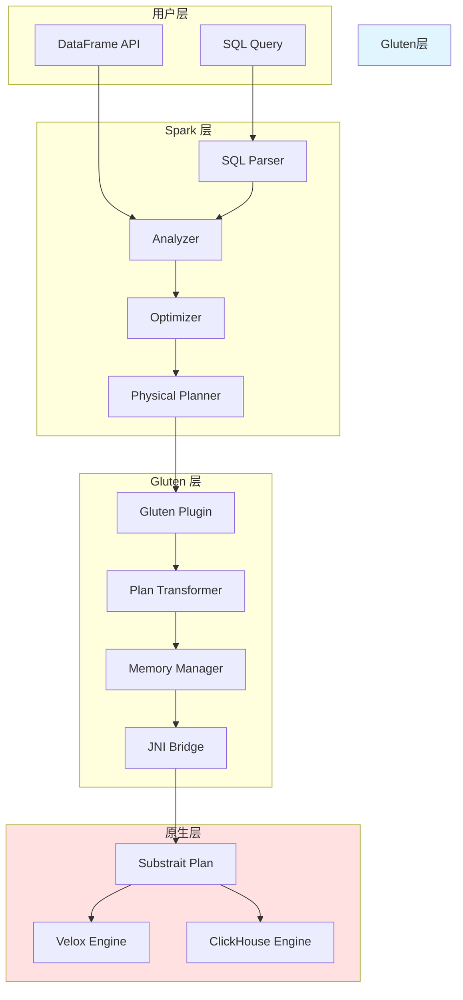
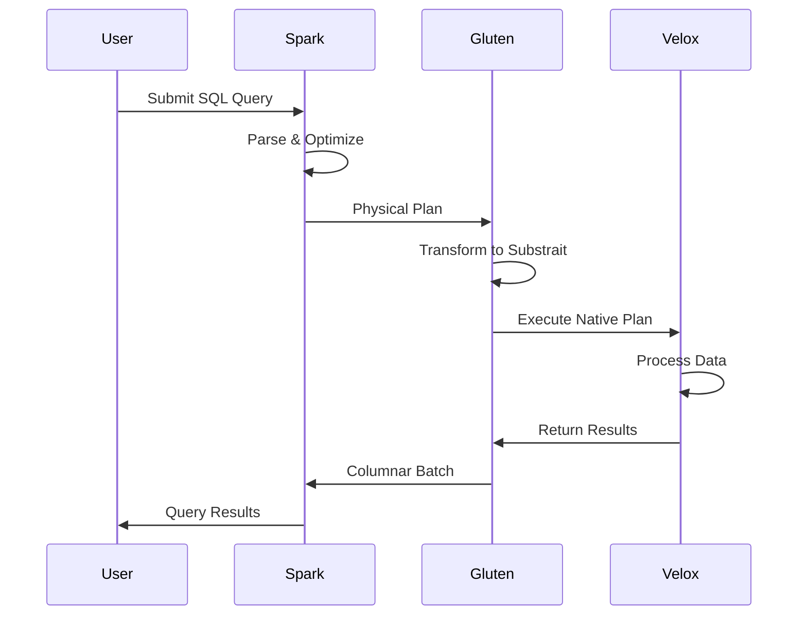
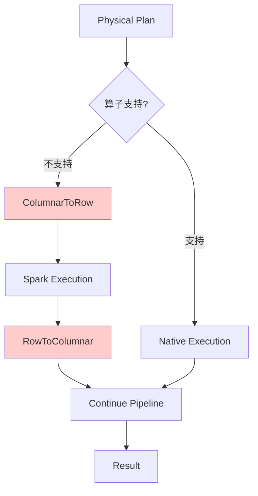
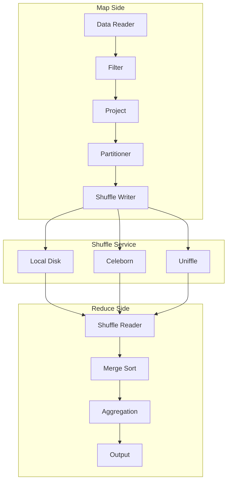

# Gluten 架构图



## 数据流转过程



## 内存管理架构

```mermaid
graph LR
    subgraph "JVM Heap"
        SparkMem[Spark Memory]
        ObjPool[Object Pool]
    end
    
    subgraph "Off-Heap"
        GlutenMem[Gluten Memory]
        VeloxMem[Velox Memory]
        ArrowMem[Arrow Memory]
    end
    
    subgraph "Native"
        Malloc[Native Malloc]
        HugePages[Huge Pages]
    end
    
    SparkMem --> GlutenMem
    GlutenMem --> VeloxMem
    VeloxMem --> ArrowMem
    ArrowMem --> Malloc
    Malloc --> HugePages
    
    style "Off-Heap" fill:#ffffcc
    style Native fill:#ffcccc
```

## Fallback 流程



## Shuffle 架构


